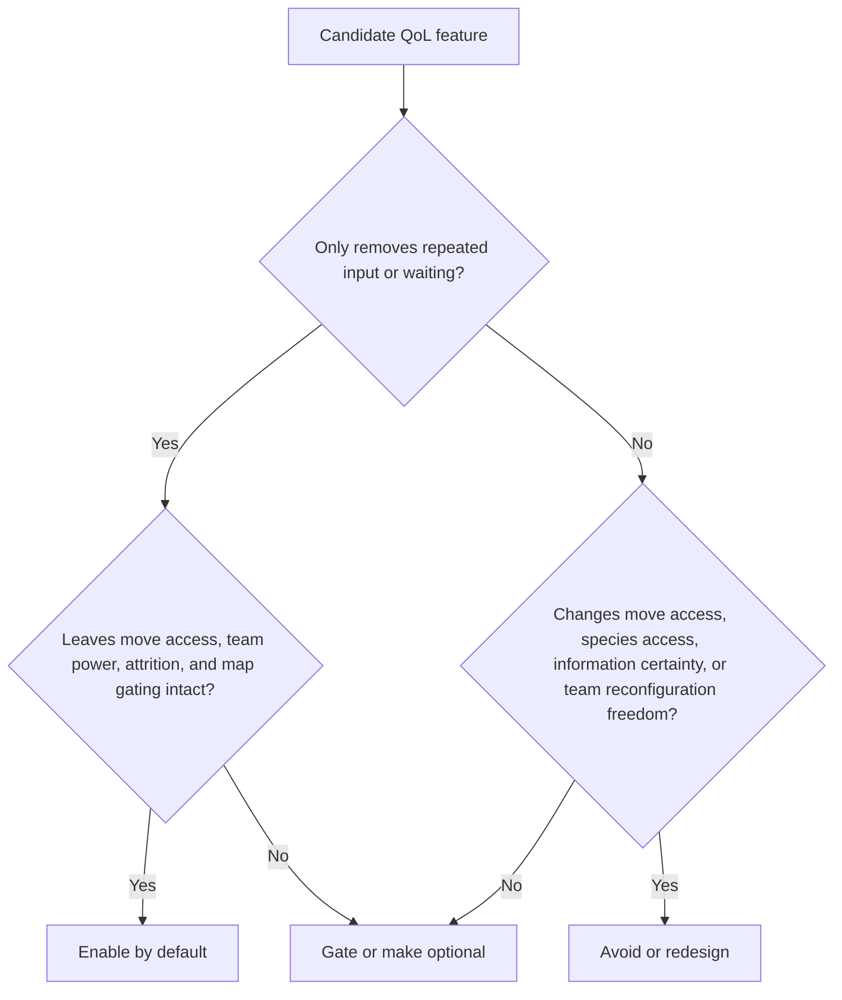

# QoL Features for a Hard Pokémon Gen 2 Overhaul

## Executive Summary

- A safe baseline of Gen 2 romhack QoL is pretty clear by now: running shoes, auto-Repel, faster text/save/UI, clearer move and menu information, and small Gen 2-specific cleanup like simpler clock reset or instant Kurt processing show up repeatedly in official hack docs, and players ask for the same things in recommendation threads. Those changes mostly remove dead time rather than alter the game’s decision structure. citeturn7view0turn7view1turn4view0turn11view0turn20view0turn12search0

- The main danger zone is not movement speed; it is **commitment systems**. Reusable TMs, easy relearners/tutors, HM-slot relief, trade-evo solutions, poison stopping at 1 HP, and rich in-game intel tools are all popular, but they also change move scarcity, route attrition, roster power, or the certainty of boss prep. Those are not automatically bad, but they are not “free” QoL. citeturn28search3turn16search8turn26search1turn27search15turn4view0turn7view0

- For a fair-but-very-hard Gold overhaul where boss fights and team prep matter, the best rule is simple: **delete repeated inputs and waiting; preserve costs on commitment, access, and planning**. If the player has already made the decision and is just mashing through friction, speed it up. If the feature lets the player dodge scarcity, map gating, or team lock-in, gate it, make it optional, or cut it. citeturn29search13turn16search8turn14search11turn26search0

- My bottom-line recommendation is: **enable low-risk anti-tedium by default; make commitment-changing convenience optional or progression-gated; avoid anytime-access and free-respec systems**. That gives you a hard hack that feels demanding for the right reasons, not because Gen 2 menus are slow. citeturn24search1turn16search2turn16search5turn11view0

## Evaluation Framework

This report treats a feature as **low-risk QoL** only when it removes repeated input, waiting, or opaque UI **after** the player has already made the meaningful choice. That distinction matters in vanilla Gen 2: the official manual states that TMs are single-use while HMs are reusable, and Gen 2 storage also required save-gated box management, so many modernizations are not merely cosmetic; they revise old commitment or friction systems. I therefore separate “pure anti-tedium” from “liked, but balance-relevant” convenience. citeturn28search3turn29search13

I also do **not** treat outright challenge rules as QoL. Level caps, enforced Set mode, or banning item use in battle can be good design, but they author difficulty directly. One legacy-style Crystal enhancement, for example, includes force-Set / no-item options alongside QoL work; that is useful, but it is difficulty policy, not housekeeping. Complexity estimates below assume modern disassembly-style Gen 2 tooling and existing community patch/tutorial ecosystems. citeturn11view0

Expectation levels below are relative to the **active Gen 2 romhack audience**, not cartridge purists. They are inferred from repeated official feature lists and community recommendation threads, with official/readme-style documentation on entity["company","GitHub","code hosting"] weighted most heavily and then checked against discussion on entity["organization","PokéCommunity","pokemon forum"] and listing pages such as entity["organization","ROMhacking.net","romhacking community"]. citeturn5view0turn4view0turn11view0turn20view0turn18search0turn12search0turn24search1

## Common Low-Risk QoL Players Appreciate

The safest cluster is the stuff that modern players now expect precisely because it saves time without widening the player’s strategic option set. Official docs for multiple major Gen 2 hacks converge hard on this category. citeturn7view0turn7view1turn4view0turn11view0turn20view0

| QoL item | Why it is low-risk | Impl. complexity | Likely expectation | Default or optional |
|---|---|---:|---|---|
| Running Shoes / always-run toggle | Near-baseline in major Gen 2 enhancement hacks and recommendation threads. At normal run speed, this mostly shortens dead travel and backtracking without changing encounters, move access, or party power. The safe version is **walk → run**, not hidden buffs to every traversal mode. citeturn7view0turn4view0turn11view0turn20view0turn12search0 | Medium | High | **Enable by default**, with an options toggle |
| Continuous Repel / automatic reuse prompt | The decision “I still want no encounters” has already been made; the prompt just saves repeated bag menuing. Same logic applies to “keep fishing?” / repeated field-action prompts. It trims input tax without changing route choice. citeturn7view1turn4view0turn11view0turn20view0 | Low | High | **Enable by default** |
| Faster text, removed save delay, trimmed redundant battle text, exact-quantity purchase UI | These changes reduce waiting, not choices. Fast text default, shorter/fewer repetitive battle messages, no artificial save delay, and buying exact coin amounts make the game feel less ancient without changing the economy or battle outcomes. citeturn7view3turn4view0turn11view0 | Low to Medium | High | **Enable by default** |
| Basic rule transparency in UI | Showing move stats, showing the move name when receiving a TM/HM, distinguishing “move failed” from “move missed,” and turning the player away from the nurse after healing all reduce avoidable confusion and misinputs. They expose rules already in the game rather than adding power. citeturn7view3turn11view0turn4view0 | Low to Medium | Medium-High | **Enable by default** |
| PC/storage QoL at terminals only | Gen 2’s original box system required save-gated box changes; modern terminal-side storage cleanups remove gotcha friction and reduce clerical work. As long as the PC remains a place you must physically reach, this is mostly anti-tedium rather than strategic erosion. citeturn29search13turn5view0turn7view5 | Medium | Medium | **Enable by default** |
| Gen 2-specific admin cleanup | Instant Kurt processing, a simpler clock reset, and exact coin-buying are unusually “Gen 2 painpoint” fixes. They remove waiting or awkward procedures while leaving the actual battle game alone. citeturn11view0turn4view0 | Low to Medium | Medium | **Enable by default** |
| Cosmetic and non-mechanical UI polish | Extra trainer-card pages, species mini-sprites/icons, badge-color polish, or palette toggles are effectively free. The only real caution is to keep style changes toggleable if you care about preservationist taste. citeturn11view0turn4view0 | Medium | Medium | **Enable by default** for structural UI polish; **optional** for palette/cosmetic swaps |

## QoL Players Like but That May Affect Difficulty, Pacing, Resource Pressure, or Identity

This is where hard-hack design lives or dies. These features are popular because they feel modern and respectful, but they are not neutral. The mechanism of impact matters more than whether players like them. citeturn16search8turn24search1turn26search0turn27search15

| QoL item | Mechanism of impact | Impl. complexity | Likely expectation | Default or optional |
|---|---|---:|---|---|
| Reusable TMs | In vanilla Gen 2, TMs are single-use. Making them reusable lowers move scarcity, reduces fear of “wasting” a TM, and makes benching/retooling much cheaper. Community discussion openly values this because it widens move experimentation, and at least one preservationist Gen 2 hardening project explicitly kept TMs single-use in standard mode while only making them reusable in Easy Mode. If your hack wants boss prep to matter, blanket reusable TMs significantly lower commitment pressure. citeturn28search3turn16search8turn24search1turn16search2turn16search5 | Low | High | **Optional or gated**; if enabled, redesign TM placement/pricing around it |
| Move Reminder and broad tutor access | A simple reminder NPC is player-friendly, but once relearning and tutor access become cheap, broad, and early, team prep turns into repeated loadout swapping. This is especially true when future level-up moves, egg moves, or big tutor catalogs are easy to access. Great for convenience; materially weaker commitment. citeturn7view2turn4view0 | Medium | High | **Optional / progression-gated / paid**, not frictionless |
| HM-slot relief | Players clearly want “no HM slave” solutions, and some Gen 2 hacks use backup systems or more generous HM compatibility to reduce dead slots. But HM friction is not purely cosmetic: freeing a moveslot raises effective battle strength, and removing field-move burdens changes route logistics and regional feel. The safest version is **partial relief**: keep HM acquisition and badge gating, but let field use happen from context or via a backup device. citeturn26search0turn26search1turn20view0turn28search21 | Medium to High | Medium-High | **Enable only as a partial system** |
| Trade-evolution solutions | Community sentiment strongly favors removing the need for external trading, and modern Gen 2 enhancements frequently add item-based or alternate methods. The upside is obvious fairness in single-player. The downside is roster power: giving easy access to monsters like Gengar, Alakazam, Golem, Scizor, or Kingdra changes matchup coverage and boss-answer density. That is usually worth doing, but it is a balance choice, not just QoL. citeturn6view0turn1search2turn27search15 | Low to Medium | High | **Enable**, but gate/tune strong species intentionally |
| Poison stopping at 1 HP outside battle | This is widely liked and appears in major Gen 2 enhancement docs, but it reduces route attrition and weakens early antidote/party-health pressure. That impact is small in boss-centric design, but it is real. If your hard mode wants overworld attrition to matter, this is not free. citeturn7view0turn4view0 | Low | Medium-High | **Optional** unless your hack de-emphasizes route attrition |
| Rich in-game intel tools | A better Dex or summary screen is usually excellent. The tension appears when “better info” becomes “complete deterministic scouting”: full learnsets, encounter rates, DVs, Hidden Power type/power, and optional wild-DV display. That moves prep from external wiki use into the ROM—which is good—but it also lowers uncertainty and can encourage exact hard-counter construction. Best practice is split treatment: basic move/species/location info on by default; exact DV/Hidden Power tools optional or unlockable. citeturn5view0turn4view0 | Medium to High | Medium | **Mixed**: basic info default, exact optimization info optional/unlockable |

## QoL That Would Likely Conflict with a Hard Gen 2 Hack

These are the features I would treat as red flags for your specific goal. They either erase commitment, erase geography, or let the player rebuild an answer too cheaply. Some players enjoy them; that does not make them a good fit for a hard Gold overhaul built around preparation. citeturn4view0turn11view0turn16search2turn26search1

| QoL item | Why it conflicts with a hard Gen 2 project | Impl. complexity | Likely expectation | Default or optional |
|---|---|---:|---|---|
| Free or PC-based re-spec suites | Once reminder/tutor functionality becomes broad and teachable from PCs, the player can repeatedly manufacture the exact anti-boss moveset with little cost. That shifts the game from “build and commit” to “hot-swap the answer.” If your design pillar is meaningful team prep, this works against you. citeturn4view0 | High | Medium | **Avoid by default**; if present, gate heavily and charge real cost |
| DV / Hidden Power optimization dashboards and chaining systems | Exact DV visibility, Hidden Power targeting, optional wild-DV overlays, and chaining/reroll systems are great for collectors and optimizer-minded players, but they make pre-boss min-maxing much more deterministic. In a hard hack, that tends to reward labbing perfect micro-answers rather than broader roster planning. citeturn4view0 | High | Low-Medium | **Avoid**, or reserve for postgame / side mode |
| Portable PC / anywhere party swapping | Modernizing terminal-side storage is one thing. Letting players reconfigure their party from anywhere is another. That cuts out route commitment, catch/bench planning, and the “enter the area with the six you chose” pressure that helps a hard hack feel deliberate. citeturn29search13turn5view0turn7view5 | High | Low-Medium in Gen 2 | **Avoid** |
| Full HM erasure / permanent route-state shortcuts | Community demand often starts as “don’t force an HM slave,” which is reasonable. But going all the way to “HMs effectively do not exist” or “field obstacles stay gone forever everywhere” strips weight from exploration sequencing and from Gen 2’s geography. Partial relief is good; total erasure is identity loss. citeturn26search0turn26search1turn28search21 | Medium to High | Medium | **Avoid full erasure** |
| Soft-reset on wipeout / instant retry loops in the base mode | One documented Gen 2 enhancement uses soft reset on wipeout only for a dedicated hardcore mode. Making that baseline in a hard standard mode encourages brute-force iteration and cheapens the consequence of bad prep. If you want fast retries, put them behind a separate challenge profile, not the default campaign. citeturn11view0 | Low to Medium | Low-Medium | **Avoid by default** |

## Examples From Notable Gen 2 Romhacks

Notable Gen 2 hacks do **not** converge on one universal QoL package. They split into at least three families: enhancement-plus, feature-rich convenience, and preservationist/selective convenience. That split is exactly why a hard Gold overhaul should make its QoL policy explicit instead of inheriting “modern” features blindly. citeturn5view0turn4view0turn11view0turn20view0turn16search2turn26search1

| Hack | Specific QoL examples from primary/community sources | What it teaches |
|---|---|---|
| **entity["video_game","Pokémon Polished Crystal","crystal rom hack"]** | Running Shoes, unlimited-use TMs, continuous Repel, faster storage UX, modernized Dex/summary screen, move reminder, fast text default, move stat display, and a 60fps overworld all appear in official repo docs. citeturn5view0turn7view0turn7view2turn7view3 | This is the clearest example of a “modernized definitive version” philosophy: strong convenience, strong transparency, but also major systemic modernization. Excellent reference for what players now assume, less ideal as a one-to-one model for commitment-heavy difficulty. |
| **entity["video_game","Pokémon Crystal Clear","crystal rom hack"]** | Official documentation lists running shoes, powerful Dex/search/location data, DV/Hidden Power visibility, optional wild-DV display, tutor moves teachable from the PC after unlocking, repeat-use prompts, exact coin-buying UI, clock reset without passwords, eggs releasable from PC, and poison fading at 1 HP. citeturn4view0 | This is the “feature-rich convenience” end of the spectrum. Great proof that players love deep UX and information tools; also a warning that too much convenience can make prep hyper-deterministic. |
| **entity["video_game","Pokémon Crystal Legacy","crystal rom hack"]** | Official repo materials credit implemented features such as move reminder and egg-move reminder, instant Kurt balls, automatic Repel reuse, running shoes, pack sorting, removed save delay, simpler clock reset, extra stats pages, and better battle text clarity. citeturn11view0 | Strong example of a legacy-style enhancement that mixes preservation with carefully selected convenience, while still being willing to expose optional challenge rules separately. |
| **entity["video_game","Pokémon Crystal Awakening","crystal rom hack"]** | Official README lists harder important-trainer rosters, more generous HM compatibility, every species obtainable on one save, running shoes, and automatic Repel reuse. citeturn20view0 | Useful example of a hack that is harder and still clearly anti-tedium, but does not go as far into data visibility or respec convenience as the most feature-rich projects. |
| **entity["video_game","Pokémon Core Crystal","crystal rom hack"]** | Community page snippets state that standard mode keeps TMs non-reusable and removes running shoes, while Easy Mode adds reusable TMs; the project describes itself as original-Crystal-experience-plus-QoL rather than maximal modernization. citeturn14search11turn16search2turn16search5 | Important counterexample: selective omission can be deliberate, not primitive. If you want the difficulty/feel of slower commitment-heavy play, you can choose not to import every “expected” comfort. |
| **entity["video_game","Pokémon Sour Crystal","crystal rom hack"]** | Community pages describe a Pager system that removes the need for HM slaves while still letting HMs work like the original game, and also note a move reminder while explicitly not having running shoes. citeturn26search1turn13search10 | Best example of a compromise HM solution: relieve slot tax without fully deleting the field-move layer. |

## Recommended Policy for This Project

For **your** stated goal, I would ship the project with a strict rule: **keep decision costs, kill clerical costs**. That means default-on movement/UI cleanup, partial relief for field friction, and real skepticism toward anything that turns boss prep into cheap respec. The strongest version of your project is not “anti-QoL”; it is “anti-fake difficulty.” citeturn16search8turn24search1turn26search0turn27search15

| Feature | Balance impact | Pacing impact | Difficulty impact | Identity impact | Recommended policy |
|---|---:|---:|---:|---:|---|
| Running Shoes | Low | High positive | Low | Low | **Enable** |
| Auto-Repel / repeat prompts | Low | Medium positive | Low | Low | **Enable** |
| Fast text / save / UI cleanup | Low | High positive | Low | Low | **Enable** |
| Better move/menu transparency | Low | Medium positive | Low | Low | **Enable** |
| Reusable TMs | Medium | Medium positive | Medium negative | Medium | **Optional or gated** |
| Reminder / broad tutors | Medium-High | Medium positive | Medium-High negative | Medium | **Optional, costly, or mid/late gated** |
| HM relief | Medium | High positive | Medium negative | High | **Partial only** |
| Trade-evo fixes | Medium-High | Medium positive | Medium negative unless rebalanced | Medium | **Enable, but tune timing/power** |
| Exact DV / Hidden Power / optimization tools | Medium | Low-Medium positive | Medium negative | Medium | **Optional or unlockable** |
| Portable PC / anywhere party swaps | High | Medium positive | High negative | High | **Avoid** |
| Wipe-retry convenience in base mode | Low | Low positive | High negative | Medium | **Avoid** |

My short, direct recommendation is this:

- **Enable by default:** Running Shoes, auto-Repel, fast text and save/UI cleanup, better move/menu clarity, smarter terminal-side PC behavior, simpler clock reset, instant Kurt, and other “same decisions, fewer button presses” fixes. citeturn7view0turn7view1turn4view0turn11view0turn20view0

- **Enable only in constrained form:** HM relief, trade-evo solutions, and richer in-game information. Keep HM acquisition and badge gating. Gate stronger trade evolutions or rebalance around them. Put exact DVs/Hidden Power behind an unlock, optional mode, or late-game tool. citeturn26search1turn27search15turn4view0turn6view0

- **Make optional or avoid:** reusable TMs, broad reminder/tutor convenience, PC-based re-spec, and anything approximating portable PC or instant retry loops. If your hack is about meaningful boss prep, these systems risk turning the prep game into “swap the exact answer in five minutes.” citeturn28search3turn16search8turn16search2turn16search5turn4view0turn11view0

The cleanest design mantra is: **make the player spend thinking time, not menu time**. If a feature preserves scarcity, geography, and commitment while removing mashing, it belongs. If it lets the player dodge those constraints, it is not QoL anymore; it is a balance decision, and for your project it should be treated like one.