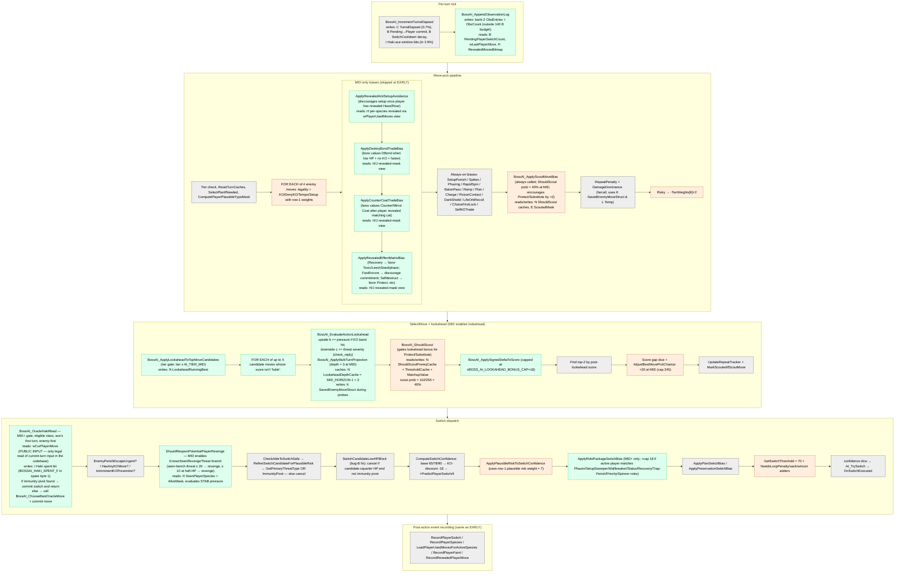

# Boss AI Decision Flowchart by Tier (2026-05-27)

## Purpose

This doc maps the boss AI's turn-loop decisions at each progression tier
(EARLY / MID / LATE) against its 140-byte WRAMX bank-1 reserve, annotated
so high-cost low-value components are easy to spot.

**Analysis-only** — no source changes. Structural concerns are flagged in
the [Follow-ups](#follow-ups-for-cole) section at the end.

## Reading the WRAM annotations

The boss AI WRAM block is a **140-byte hard reserve** in WRAMX bank 1
(`ram/wram.asm:2419-2496`, enforced by
`ds 140 - (wBossAIStateEnd - wBossAITier)`). Per `docs/generated/dev_index.md`
the normal build currently consumes **112 bytes (80.0%)** leaving 28 free,
and the `BOSS_AI_TRACE` build adds 28 more to fill the reserve at 140/140.

Every node in the flowcharts below cites the **functional WRAM group** it
touches (A–N, defined in the [WRAM budget table](#wram-budget--the-140-byte-bank-1-reserve)).
Percentages are share of the 140-byte reserve so a node's footprint is
comparable across tiers.

A node that fires at all three tiers but draws on different WRAM groups at
each tier is annotated per-tier.

> A secondary 25-byte block lives in **WRAMX bank 2** for the public
> observation log (P5). That bank has no scarcity pressure today, so it is
> tracked separately and **does not count against the 140-byte budget**.

## Tier identity recap

| Tier value | Symbol | Roster (canonical) | Boss AI overlay |
| ---: | --- | --- | --- |
| 0 | `AI_TIER_BASELINE` | All ordinary trainers | Overlay does nothing — vanilla AI only |
| 1 | `AI_TIER_EARLY` | Falkner, Bugsy, Whitney (badges 1–3) | KO/pressure/tempo scoring with low tier weights |
| 2 | `AI_TIER_MID` | Morty, Chuck, Jasmine, Pryce; Rival post-stage 3; Rocket execs (badges 4–6) | Adds Haki, lookahead, role packages, revealed-effect biases, observation log |
| 3 | `AI_TIER_LATE` | Clair, E4, Champion, Red, post-game (badges 7–8 onward) | Adds ace timing, hard sack, coach plans, scout move bias, KO-band calibration, +1 lookahead horizon |

Source of truth for class → tier: `data/trainers/ai_tiers.asm`
(`BossAITierMap`); consumed at `engine/battle/read_trainer_attributes.asm:69`.
Per-class **ramp row** (default = `tier-1`, override via
`BossAITierRampMap`) lets early-tier trainers preview MID-shaped weights
without flipping their gate-conditional features on.

## WRAM budget — the 140-byte bank-1 reserve

| Group | Label(s) | Bytes | % of 140 | Purpose |
| --- | --- | ---: | ---: | --- |
| **A. Tier gate + handoff** | `wBossAITier`, `wBossAIMoveChoiceReady` | 2 | 1.4 | Identity + move-pick handoff to `engine/battle/ai/move.asm` |
| **B. Switch state + anti-loop** | `wBossAISwitchConfidence`, `wBossAILastSwitchedOut`, `wBossAISwitchCooldown`, `wBossAIPlayerSwitchCount`, `wBossAIPendingPlayerSwitchCount` | 5 | 3.6 | Switch decision output + loop-prevention + player switch tempo |
| **C. Turn counter** | `wBossAITurnsElapsed` | 1 | 0.7 | Turn tick, drives setup-affordability + Haki ace window |
| **D. Plan / role / wincon** | `wBossAIPlanId`, `wBossAIPlanPhase`, `wBossAIPlanConfidence`, `wBossAIWinconMonIdx`, `wBossAITargetMonIdx` | 5 | 3.6 | Plan state + wincon/target marker for plan-driven biases |
| **E. Scout + repeat** | `wBossAIScoutedMask`, `wBossAIRepeatCount`, `wBossAILastChosenMove` | 3 | 2.1 | Per-species scout pivot bitmap + same-move repeat tracker |
| **F. Plausible-type cache** | `wBossAIPlausibleTypeMaskSpecies`, `wBossAIPlausibleTypeMaskLevel`, `wBossAIPlausibleTypeMaskCache` (4) | 6 | 4.3 | Cache key (species + level) + 4-byte "could exist" type bitmap |
| **G. Likely-type cache** | `wBossAILikelyTypeMaskCache` (4) | 4 | 2.9 | "High-evidence" subset of plausible — STAB + revealed + current-level-up |
| **H. Seen-species memory** | `wBossAISeenPlayerSpeciesCount` (1) + `wBossAISeenPlayerSpecies` (6) + `wBossAIRevealedMovesBitmap` (24) | **31** | **22.1** | Seen-species ring + per-species 4-byte revealed-type masks |
| **I. Alive bitmap + Haki/spare** | `wBossAISeenPlayerAliveMask` (1) + `wBossAIRevealedMovesBitmapSpare` (3) | 4 | 2.9 | Public alive bit per seen species + Haki spent/ace/eligible/trace bits + 1 unused spare |
| **J. Per-species used-moves mirror** | `wBossAISpeciesUsedMoves` (24) | **24** | **17.1** | Per-species mirror of `wPlayerUsedMoves`, restored on switch-back so revealed-effect biases survive player switches |
| **K. Score I/O + saved move struct** | `wBossAIScorePtr` (2) + `wBossAISavedEnemyMoveStruct` (7) | 9 | 6.4 | Current score-write pointer + saved move struct for non-destructive probes (lookahead, damage-dominance) |
| **L. Scratch** | `wBossAITemp..Temp5` | 5 | 3.6 | Helper-shared scratch (candidate idx, best-risk, etc) |
| **M. Tier ramp row** | `wBossAITierWeightRow` | 1 | 0.7 | Row index into `BossAITierWeights`; default `tier-1`, per-trainer override |
| **N. Per-tick memo caches** | `wBossAIHasKOMoveCache`, `wBossAIPublicThreatCache`, `wBossAIRevealedPriorityCache`, `wBossAIPrimaryThreatCache`, `wBossAIPublicEnemyFasterCache`, `wBossAILookaheadDepthCache`, `wBossAILookaheadRunningBest`, `wBossAILastMatchupType`, `wBossAILastMatchupResult`, `wBossAIShouldScoutPrereqCache`, `wBossAIShouldScoutThresholdCache`, `wBossAIShouldScoutMatchupValue` | 12 | 8.6 | Sentinel-bit per-tick caches that collapse repeated heavy queries from inside lookahead |
| **O. Trace fields** (under `BOSS_AI_TRACE`) | top-3 moves/scores, pre/post move-model scores, plan trace, plausible-mask snapshot, risk flags, lookahead-bonus top-N | 28 | 20.0 | Trace-build only — not in shipping builds |
| **Free / reserved** | — | 28 | 20.0 | Headroom in normal build |
| **Total** | — | **140** | **100.0** | |

Subtotal of **player-knowledge memory** (groups F+G+H+I+J) = 69 bytes = **49.3% of the reserve**. About half of every byte the overlay owns is dedicated to remembering what the player has done.

### Secondary substrate (WRAMX bank 2, separate budget)

| Label | Bytes | Purpose |
| --- | ---: | --- |
| `wBossAIObsCount` (1) + `wBossAIObsEntries` (24 = `BOSS_AI_OBS_ENTRY_SIZE` 4 × `BOSS_AI_OBS_MAX_TURNS` 6) | 25 | Public observation log: rolling 6-entry ring of `{turn, observation class, damage band, speed relation}` for MID+ tendency reads |

Bank 2 is otherwise unused (per [WRAM-relief audit findings (2026-05-18)](https://example.invalid/memory) note in MEMORY.md — "WRAMX banks 2-7 unused"), so this does not compete with the bank-1 reserve.

## Per-tier flowcharts

The skeleton is the same at every tier: per-turn tick, then if alive, the
move-pick pipeline runs, then switch-or-item dispatch runs, then event
recording fires on player actions. Tier value gates which biases/oracles
actually fire and which **values** the tier-scaled gates use.

Color legend (used in every diagram below):

| Shape / color | Meaning |
| --- | --- |
| 🟩 grey | Always fires (every tier) |
| 🟨 yellow | Tier-scaled — same gate, different value per tier |
| 🟦 blue | MID+ only |
| 🟪 purple | LATE only |
| 🟥 pink | EARLY only |

Each flowchart focuses on the **decision logic and WRAM touches**. Plain
data-table reads (move tables, type chart) are not shown unless they pull
from the WRAM reserve.

---

### Tier-scaled constants reference

These constants change value across tiers; cited by node where used.

| Constant | EARLY | MID | LATE | Source |
| --- | ---: | ---: | ---: | --- |
| Switch threshold | 80 | 70 | 60 | `constants/battle_constants.asm:62-64` |
| Plausible risk weight | 4 | 7 | 10 | `:79-81` |
| Scout probability (out of 255) | 51 (≈20%) | 102 (≈40%) | 153 (≈60%) | `:82-84` |
| Lookahead horizon (turns - 1) | 0 (disabled) | 3 | 4 | `:75-76` + `BOSS_AI_LOOKAHEAD_ENABLE_TIER_MIN = 2` |
| Best-pick dice bonus (gap ≥ 3) | +0 | +20 (cap 245) | +32 (cap 252) | `boss_policy_move.asm:2940-2982` |
| Observation window | n/a | 3 turns | 6 turns | `BOSS_AI_OBS_MID_TURNS`/`MAX_TURNS` `:92-93` |
| `BossAITierWeights` row (KO / DenyKO / Tempo / Setup / Status / Role / Risk) | 4 2 1 1 1 1 2 | 5 3 2 2 1 1 2 | 7 4 4 2 2 3 1 | `boss_policy_move.asm:6373-6375` |

---

### EARLY-tier flowchart

The EARLY skeleton is the simplest: vanilla scoring runs, then the boss
overlay applies KO/pressure/tempo/setup/status/role weights with the lowest
multipliers, runs the always-on revealed-effect-free biases, and SelectMove
picks deterministically by score. No Haki, no lookahead, no MID+
revealed-effect biases, no LATE-only ace-timing / sack-hard / coach plans.

```mermaid
flowchart TD
    classDef always fill:#eee,stroke:#666,color:#000
    classDef early fill:#fde,stroke:#c47,color:#000
    classDef scaled fill:#fed,stroke:#c74,color:#000

    subgraph TICK["Per-turn tick<br/>(engine/battle/core.asm:158)"]
        T1["BossAI_IncrementTurnsElapsed<br/>writes: C TurnsElapsed (0.7%),<br/>I Haki ace window bits (in 2.9%),<br/>B PendingPlayerSwitchCount→PlayerSwitchCount commit (3.6%),<br/>B SwitchCooldown decay"]:::always
    end

    subgraph MOVEPICK["Move-pick pipeline — runs once per turn before player input<br/>(BossAI_ApplyMoveModel @ boss_policy_move.asm:172)"]
        M1["Tier == 0? early return<br/>reads: A wBossAITier (0.7%)"]:::always
        M2["BossAI_ResetTurnCaches<br/>clears: N 12-byte cache sentinels (8.6%)"]:::always
        M3["SelectPlanIfNeeded<br/>reads/writes: D Plan/Role/Wincon (3.6%)<br/>EARLY picks: TEMPO_PRESSURE / SETUP_SWEEP / STATUS_CHOKE / ANTI_SETUP_DENIAL only"]:::always
        M4["ComputePlayerPlausibleTypeMask<br/>reads: F species/level cache key (4.3%)<br/>writes: F MaskCache (4 B) + G LikelyMaskCache (4 B = 2.9%)<br/>reads H 6-species ring + revealed bitmap (22.1%)"]:::always

        M5["FOR EACH of 4 enemy moves:"]:::always

        M5a["HeldItemMoveBlocked<br/>(Choice lock + Assault Vest)<br/>writes: K ScorePtr (saturate to 80)"]:::always
        M5b["DamagingMoveBlockedByTypeImmunity<br/>writes: K ScorePtr (saturate to 80)"]:::always
        M5c["GhostCurseBlockedPublicly + PainSplitBlockedPublicly<br/>writes: K ScorePtr (saturate to 80)"]:::always

        M6["KO pressure?<br/>caches: N HasKOMoveCache + PublicEnemyFasterCache<br/>writes: K score -= TierWeights[0]=4"]:::scaled
        M7["EnemyUnderPressure + DenyKO effect + answers public threat?<br/>reads: N PublicThreatCache + RevealedPriorityCache<br/>writes: K score -= TierWeights[1]=2"]:::scaled
        M8["Tempo (priority OR SE + faster)?<br/>reads: N PublicEnemyFasterCache<br/>writes: K score -= TierWeights[2]=1"]:::scaled
        M9["Setup move?<br/>safe → score -= TierWeights[3]=1<br/>unsafe → score += 1"]:::scaled
        M10["SetupDisciplineBias<br/>(only before turn 2 at full HP)<br/>reads: C TurnsElapsed"]:::always
        M11["UtilityMoveWouldFailPublicly?<br/>(Disable / Encore / Substitute already up / Dream Eater target awake / etc)<br/>writes: K score += 24"]:::always
        M12["RecoveryTimingDiscipline"]:::always
        M13["early_stat_drop_discipline<br/>EARLY-only: penalize premature stat-drop spam"]:::early
        M14["Status effect?<br/>fails publicly → K score := 80 (saturated)<br/>else → score -= TierWeights[4]=1 + hard-answer discipline"]:::scaled
        M15["SetupPunishBias / SpikesLayerBias / PhazingPlanBias / RapidSpinBias / BatonPassBias"]:::always
        M16["RampMoveBias / PlanMoveBias (uses D PlanId/Phase)"]:::always
        M17["ChargeMoveBias / PoisonContactRiskBias / DarkShieldChanceBias / LifeOrbRecoilBias"]:::always
        M18["ChoiceFirstLockRegret / SelfKOTradeDiscipline"]:::always
        M18b["BossAI_ApplyScoutMoveBias<br/>(always called; ShouldScout prereqs + 20% scout prob at EARLY → rarely encourages Protect/Substitute by +2)<br/>reads: E ScoutedMask, N ShouldScoutPrereqCache/ThresholdCache/MatchupValue"]:::scaled
        M19["RepeatPenalty<br/>reads: E LastChosenMove + RepeatCount (2 B of 2.1%)"]:::always
        M20["BossAI_ApplyDamageDominanceBias<br/>(cross-bank farcall via thunk; reads K ScorePtr; uses L Temp2-Temp5)"]:::always
        M21["PureStatusHardBlockOnStrongDamage"]:::always
        M22["HasKOLine shortcut → early return ret"]:::always
        M23["Risky accuracy / risky effect?<br/>writes: K score += TierWeights[6]=2"]:::scaled

        M5 --> M5a --> M5b --> M5c --> M6 --> M7 --> M8 --> M9 --> M10 --> M11 --> M12 --> M13 --> M14 --> M15 --> M16 --> M17 --> M18 --> M18b --> M19 --> M20 --> M21 --> M22 --> M23
    end

    subgraph SELECT["SelectMove (boss_policy_move.asm:2786)"]
        S1["Find top-2 scored moves (skip ≥80 sentinels)"]:::always
        S2["Score gap dice<br/>gap ≥6 → 90% best (230/256)<br/>gap ≥3 → 75% best (192/256)<br/>else → 60% best (154/256)<br/>EARLY: no AdjustBestMovePickChance bump"]:::early
        S3["BossAI_UpdateRepeatTracker<br/>writes: E LastChosenMove, RepeatCount (2.1%)"]:::always
        S4["BossAI_MarkScoutedIfScoutMove<br/>(Protect/Substitute → set E ScoutedMask bit)"]:::always
    end

    subgraph SWITCH["Switch-or-item dispatch — runs after player input<br/>(BossAI_TrySwitch @ boss_policy_switch.asm:17)"]
        W1["ResetTurnCaches (again — switch path is separate tick)"]:::always
        W2["SelectPlanIfNeeded + ComputePlayerPlausibleTypeMask"]:::always
        W3["EnemyPerishEscapeUrgent? → force consider switch"]:::always
        W4["HasAnyKOMove?<br/>reads: N HasKOMoveCache"]:::always
        W5["IsImminentKOPrevention?<br/>(quarter HP, public threat, or revenge respect)"]:::always
        W6["ShouldRespectPotentialPlayerRevenge?<br/>EARLY: priority-threat or primary-threat-severity≥3 only<br/>(KnownSeenRevengeThreat branch is MID+ only — never fires here)"]:::always
        W7["CheckAbleToSwitchSafe<br/>writes: L Temp + wEnemySwitchMonParam (boss-engine field)"]:::always
        W8["RefineSwitchCandidateForPlausibleRisk<br/>writes: L Temp2-5 risk scratch (3.6%)"]:::always
        W9["GetPrimaryThreatType OR ImmunityPivot — else cancel"]:::always

        W10["ComputeSwitchConfidence base by candidate quality:<br/>candidate $30=high → 90<br/>candidate $20=med → 78<br/>else → 65<br/>then -18 if HasAnyKOMove"]:::always
        W11["PerishEscape +40 cap 99"]:::always
        W12["+PredictPlayerSwitch / 4<br/>reads: B PlayerSwitchCount, C TurnsElapsed"]:::always
        W13["ApplyPlausibleRiskToSwitchConfidence<br/>(subtracts cooked candidate risk from confidence)"]:::always
        W14["ApplyPlanSwitchBias / ApplyPreservationSwitchBias<br/>reads: D WinconMonIdx + PlanId"]:::always
        W15["GetSwitchThreshold = 80<br/>+10 if NeedsLoopPenalty (LastSwitchedOut, SwitchCooldown)<br/>+8 if ShouldSackInsteadOfSwitch<br/>+10 if IsSwitchingIntoWinconRisk"]:::scaled
        W16["confidence dice (margin ≥20 → 90%, ≥10 → 75%, else 55%)"]:::always
        W17["AI_TrySwitch (execute) → BossAI_OnSwitchExecuted<br/>writes: B LastSwitchedOut, SwitchCooldown<br/>writes: E RepeatCount=0, LastChosenMove=0"]:::always

        W3 --> W4 --> W5 --> W6 --> W7 --> W8 --> W9 --> W10 --> W11 --> W12 --> W13 --> W14 --> W15 --> W16 --> W17
    end

    subgraph EVENTS["Post-action event recording"]
        E1["RecordPlayerSwitch (player switched this turn)<br/>writes: B PendingPlayerSwitchCount"]:::always
        E2["RecordPlayerSpecies (NewBattleMonStatus on send-out)<br/>writes: H SeenPlayerSpeciesCount + SeenPlayerSpecies (22.1%)<br/>writes: I SeenPlayerAliveMask bit (2.9%)"]:::always
        E3["LoadPlayerUsedMovesForActiveSpecies (on send-out)<br/>reads: J SpeciesUsedMoves (24 B = 17.1%) → wPlayerUsedMoves"]:::always
        E4["RecordPlayerFaint (player active KO'd)<br/>writes: I SeenPlayerAliveMask clear bit"]:::always
        E5["RecordRevealedPlayerMove (UsedMoveText fired)<br/>writes: H per-species RevealedMovesBitmap bit (in 22.1%)<br/>writes: J SpeciesUsedMoves mirror (17.1%)<br/>writes: F MaskSpecies / MaskLevel = 0 (invalidate cache)"]:::always
    end

    TICK --> MOVEPICK
    MOVEPICK --> SELECT
    SELECT --> SWITCH
    SWITCH --> EVENTS
```

**Node footprint summary (EARLY) — WRAM groups actually touched:**

| Group | % | Notes |
| --- | ---: | --- |
| A. Tier gate + handoff | 1.4 | always |
| B. Switch state + anti-loop | 3.6 | always |
| C. Turn counter | 0.7 | always |
| D. Plan / role / wincon | 3.6 | always (EARLY plan menu: 4 of 5 plans, no LATE-only WALLBREAK_THEN_CLEAN default) |
| E. Scout + repeat | 2.1 | always |
| F. Plausible cache | 4.3 | always |
| G. Likely cache | 2.9 | always |
| H. Seen-species memory | 22.1 | always |
| I. Alive bitmap + Haki | 2.9 | alive bit always; Haki bits **always zero at EARLY** (gate-blocked) |
| J. Per-species used-moves mirror | 17.1 | always |
| K. Score I/O + saved move struct | 6.4 | always (saved-move struct mostly used by lookahead + damage-dominance; damage-dominance still fires at EARLY) |
| L. Scratch | 3.6 | always |
| M. Tier ramp row | 0.7 | always |
| N. Per-tick caches | 8.6 | **all 12 cache bytes reset every tick at EARLY too**, but only 7 of them ever get HIT at EARLY (lookahead depth cache, scout prereq cache, scout threshold cache, scout matchup value all stay sentinel because their owners are LATE/MID+ gated) |
| **EARLY effective use** | **80.0** | **same allocation as MID/LATE — tier doesn't free WRAM, it only un-fires biases** |

---

### MID-tier flowchart

MID adds Haki Oracle (per-class gated), lookahead with 4-turn horizon,
role-package switch bias, observation log (3-slot), KO-band oracle, and
all the revealed-effect biases (AntiSetup / DestinyBondTrade /
CounterCoatTrade / RevealedEffectMatrix). Tier-scaled values shift to row
1 (KO=5 / DenyKO=3 / Tempo=2 / Setup=2 / Status=1 / Role=1 / Risk=2).

**Node footprint summary (MID) — incremental over EARLY:**

| Group | % at MID | Δ vs EARLY | Notes |
| --- | ---: | ---: | --- |
| A. Tier gate | 1.4 | — | |
| B. Switch state | 3.6 | — | |
| C. Turn counter | 0.7 | — | |
| D. Plan / role | 3.6 | — | (plan menu same as EARLY at MID; coach plan template still LATE-only) |
| E. Scout + repeat | 2.1 | — | scout pivot meaningful for first time (40% prob vs 20%) |
| F. Plausible cache | 4.3 | — | |
| G. Likely cache | 2.9 | — | |
| H. Seen-species memory | 22.1 | — | finally consumed by KnownSeenRevengeThreat at MID — EARLY allocates but doesn't read it for revenge |
| I. Alive bitmap + Haki | 2.9 | — | Haki bits ACTIVE for the first time (read+written at MID for eligible classes) |
| J. Per-species used-moves mirror | 17.1 | — | revealed-effect biases (AntiSetup / DBond / Counter / Matrix) consume it for the first time at MID |
| K. Score I/O + saved struct | 6.4 | — | SavedEnemyMoveStruct now exercised by lookahead probes |
| L. Scratch | 3.6 | — | |
| M. Tier ramp | 0.7 | — | |
| N. Per-tick caches | 8.6 | — | lookahead depth cache now hits (depth=3); scout caches now exercised (40% roll); other caches more impactful as lookahead multiplies query count |
| **MID effective use** | **80.0** | **0.0** | **same allocation, more bytes actually load-bearing** |

---

### LATE-tier flowchart

LATE adds AceTimingHook, ShouldSackHard, TryCoachPlanTemplate, ScoutMoveBias,
ConsultKOBandCalibration, late_reply in lookahead, +1 horizon (5 turns vs 4),
+12 best-pick dice bonus, and 6-slot observation window. Tier-scaled values
shift to row 2 (KO=7 / DenyKO=4 / Tempo=4 / Setup=2 / Status=2 / Role=3 / Risk=1).

```mermaid
flowchart TD
    classDef always fill:#eee,stroke:#666,color:#000
    classDef mid fill:#dfe,stroke:#4c7,color:#000
    classDef late fill:#def,stroke:#47c,color:#000
    classDef scaled fill:#fed,stroke:#c74,color:#000

    subgraph TICK["Per-turn tick"]
        T1["IncrementTurnsElapsed (C, I, B)"]:::always
        T2["AppendObservationLog (bank 2; 6-slot window at LATE)"]:::mid
        T1 --> T2
    end

    subgraph MOVEPICK["Move-pick pipeline"]
        M1["Tier check, ResetTurnCaches"]:::always
        M2["SelectPlanIfNeeded — LATE enables BossAI_TryCoachPlanTemplate (reads class-specific coach plan tables) AND .late_default = WALLBREAK_THEN_CLEAN<br/>writes: D Plan/Role/Wincon"]:::late
        M3["ComputePlayerPlausibleTypeMask"]:::always
        M4["FOR EACH of 4 moves: legality → KO/DenyKO/Tempo/Setup with row-2 weights (KO=7, Tempo=4)"]:::scaled

        M5["All MID+ revealed-effect biases (AntiSetup / DBond / Counter / Matrix)"]:::mid

        M6["Spikes layer 3 LATE-specific check<br/>(boss_policy_move.asm:2250) - 3rd-layer spikes ROI gated on LATE"]:::late

        M7["Always-on biases: Setup / Phazing / RapidSpin / BatonPass / Plan / Charge / Poison / DarkShield / LifeOrb / Choice / SelfKO"]:::always

        M8["BossAI_ApplyScoutMoveBias (fires at all tiers via ShouldScout, but bonus is tier-scaled: +2 EARLY/MID, +3 LATE, boss_policy_move.asm:5285-5290)<br/>Effective fire rate scales with scout probability: 20% EARLY / 40% MID / 60% LATE"]:::scaled

        M9["RepeatPenalty + DamageDominance"]:::always

        M10["KO-band oracle pressure (BossAI_ApplyKOBandOraclePressure, ko_band_oracle.asm)<br/>MID+ gate; reads bank-2 BossAIMatchupTables data; LATE-only adds<br/>ConsultKOBandCalibration (calibrate KO band per public observation log)"]:::late

        M11["Risky → -TierWeights[6]=1 (lighter penalty than EARLY/MID)"]:::scaled

        M1 --> M2 --> M3 --> M4 --> M5 --> M6 --> M7 --> M8 --> M9 --> M10 --> M11
    end

    subgraph SELECT["SelectMove + lookahead — LATE: depth +1, late_reply discount"]
        L1["BossAI_ApplyLookaheadToTopMoveCandidates"]:::mid
        L2["FOR EACH of up to 4 candidates (futility cutoff active):"]:::mid

        L3["BossAI_EvaluateActionLookahead<br/>check_setup + check_scout + check_reply (severity into downside)"]:::mid

        L4["late_reply (LATE-only): if HasAnyKOMove, decrement reply downside<br/>'I'm going to KO them anyway so the reply matters less'"]:::late

        L5["BossAI_ApplyMultiTurnProjection<br/>depth = 4 at LATE (vs 3 at MID, 0 at EARLY)<br/>caches: N LookaheadDepthCache<br/>scans: setup, scout, threat, switch prediction, accuracy across horizon"]:::scaled

        L6["ApplySignedDeltaToScore (capped at ±18)"]:::mid

        L7["Top-2 + score gap dice; AdjustBestMovePickChance bumps best-pick odds +32 (cap 252) at LATE"]:::scaled
        L8["UpdateRepeatTracker + MarkScoutedIfScoutMove"]:::always

        L1 --> L2 --> L3 --> L4 --> L5 --> L6 --> L7 --> L8
    end

    subgraph SWITCH["Switch dispatch"]
        W0["OracleHakiRead (MID+; LATE-eligible classes include Clair, E4, Champion, Red, Blue)"]:::mid
        W1["PerishEscape / HasKOMove / ImminentKOPrevention checks"]:::always
        W2["ShouldRespectPotentialPlayerRevenge with KnownSeenRevengeThreat (MID+)"]:::mid
        W3["CheckAbleToSwitchSafe → RefineSwitchCandidateForPlausibleRisk → GetPrimaryThreatType OR ImmunityPivot"]:::always

        W4["BossAI_ShouldSackHard (LATE-only categorical sack)<br/>conditions: tier==LATE AND dying low-speed non-wincon non-asleep candidate<br/>reads: D WinconMonIdx, wEnemySubStatus*, base speed, current HP"]:::late

        W5["SwitchCandidateLowHPBlock (always)"]:::always

        W6["ComputeSwitchConfidence base 65/78/90 → -18 if HasKOMove"]:::always

        W7["AceTimingHook (LATE-only) — class in {CLAIR, WILL, BRUNO, KAREN, KOGA, CHAMPION}, last party slot, turn ≥ 5 or HP halved → +12 confidence"]:::late

        W8["+40 if PerishEscape (cap 99)"]:::always
        W9["+PredictPlayerSwitch/4 (uses bank-2 ConsultTendencyCounters bonus, 6-slot at LATE)"]:::late
        W10["ApplyPlausibleRiskToSwitchConfidence (row-2 plausible risk weight = 10)"]:::scaled
        W11["ApplyRolePackageSwitchBias (MID+, cap 18)"]:::mid
        W12["ApplyPlanSwitchBias / ApplyPreservationSwitchBias"]:::always

        W13["GetSwitchThreshold = 60 + NeedsLoopPenalty/sack/wincon adders"]:::scaled
        W14["confidence dice → AI_TrySwitch → OnSwitchExecuted"]:::always

        W0 --> W1 --> W2 --> W3 --> W4 --> W5 --> W6 --> W7 --> W8 --> W9 --> W10 --> W11 --> W12 --> W13 --> W14
    end

    subgraph EVENTS["Post-action event recording (same as EARLY/MID)"]
        E1["RecordPlayerSwitch / RecordPlayerSpecies / Load... / RecordPlayerFaint / RecordRevealedPlayerMove"]:::always
    end

    TICK --> MOVEPICK
    MOVEPICK --> SELECT
    SELECT --> SWITCH
    SWITCH --> EVENTS
```

**Node footprint summary (LATE) — incremental over MID:**

| Group | % at LATE | Δ vs MID | Notes |
| --- | ---: | ---: | --- |
| (Same A–M groups, no allocation change at LATE) | 80.0 | 0 | tier never changes allocation |
| D. Plan / role / wincon | 3.6 | — | coach plan templates exercised for first time; WALLBREAK_THEN_CLEAN late_default path active |
| E. Scout + repeat | 2.1 | — | scout pivot fires at ~60% (vs 40% MID, 20% EARLY); ScoutMoveBias active |
| N. Per-tick caches | 8.6 | — | every cache byte now load-bearing as lookahead horizon = 5 |
| **LATE effective use** | **80.0** | **0.0** | |

---

## Granular WRAM-cost vs decision-value table

Ranked by **value-vs-cost asymmetry**: a row is suspect when its byte
share is high relative to how often it actually changes a decision the
player sees. "Fire frequency" is per AI tick (one move-pick + one switch
dispatch per turn) under typical play; "Decision impact" is the
qualitative magnitude when it fires.

| Group | Bytes | % | Fires per tick (EARLY / MID / LATE) | Decision impact | Value-vs-cost read |
| --- | ---: | ---: | --- | --- | --- |
| **H. Seen-species memory** (count + species ring + revealed type masks) | 31 | 22.1 | every tick (read), plus on every send-out and reveal (write) | High — drives plausible/likely type inference, KnownSeenRevengeThreat (MID+), all scout/threat scoring | **Load-bearing.** Removing it cripples MID+ inference. EARLY tier *allocates* it but only reads it for current-active plausible mask (the seen-bench branch is MID+); see follow-up #1. |
| **J. Per-species used-moves mirror** | 24 | 17.1 | every send-out (full restore) + every reveal (mirror write) | Medium — only matters when the player switches Pokémon back in after revealing moves; recreated otherwise from vanilla `wPlayerUsedMoves` | **Cost-asymmetric.** Pays the full 17% even in battles where the player never switches a revealed mon back in. EARLY pays the full cost and never uses any of the cross-switch revealed-effect biases that justify it (Counter / Coat / Encore / Recovery / Selfdestruct memory is MID+ only). See follow-up #2. |
| **N. Per-tick memo caches** | 12 | 8.6 | every tick reset; 4–20 hits per tick at LATE | High at MID/LATE — without them, repeated heavy queries blow the per-turn frame budget | **Required for LATE perf.** Wasted at EARLY (4 of 12 sentinels are owned by routines that never run at EARLY: LookaheadDepthCache, ShouldScoutPrereqCache, ShouldScoutThresholdCache, ShouldScoutMatchupValue). See follow-up #3. |
| **K. Score I/O + saved enemy move struct** | 9 | 6.4 | ScorePtr every move scored (~4/tick); SavedEnemyMoveStruct only when lookahead/damage-dominance probes another move | Required for non-destructive probes; without SavedEnemyMoveStruct lookahead would corrupt wEnemyMoveStruct | Honest cost. The 7-byte saved struct is a fixed cost of "I want to compute another move's score without overwriting the current move." Worth confirming damage-dominance at EARLY actually needs the full struct (it farcalls cross-bank). |
| **F. Plausible-type cache** | 6 | 4.3 | cache key checked every move pick + switch; recomputed on miss (~1–2/tick) | High — keeps inference cheap and correct after switches | Honest cost. Cache key (species + level) is the right design. |
| **B. Switch state + anti-loop** | 5 | 3.6 | every switch dispatch (4 reads, 0–2 writes) | High — anti-loop and PredictPlayerSwitch both need this state to be persistent across turns | Honest cost; 5 bytes is the minimum for the behaviors documented. |
| **D. Plan / role / wincon** | 5 | 3.6 | plan selected on first tick; reads on every move/switch bias | Plan-driven biases (PlanMoveBias, PlanSwitchBias, PreservationSwitchBias, ShouldSackInsteadOfSwitch all consult these) | Honest cost. Plan/role is the cheapest way to encode trainer identity beyond the per-class branches. |
| **L. Scratch (Temp..Temp5)** | 5 | 3.6 | every move scored + every switch refinement | Required — many helpers expect scratch | **Possibly excessive.** Most helpers use Temp/Temp2/Temp3; Temp4/Temp5 are used only by `BossAI_RefineSwitchCandidateForPlausibleRisk`, `BossAI_FaintRepl_EvalCandidate`, and `BossAI_ApplyDamageDominanceBias` (which uses Temp5 specifically). Could likely fit in 3 bytes with stack-saves in the rare 4–5 byte cases. See follow-up #4. |
| **G. Likely-type cache** | 4 | 2.9 | piggy-backs on plausible cache; read on every plausible-risk computation | Medium — distinguishes "could exist" from "high evidence" so plausible-only threats get half-weight | Honest cost. Without it, plausible-only Hidden Power would dominate scoring on coverage scares. |
| **I. Alive bitmap + Haki/spare** | 4 | 2.9 | alive bit every send-out/faint; Haki bits only on MID+ ace turns; spare unused | High when fires (Haki is one-shot per battle, alive bitmap drives bench-threat scoring) | Honest cost; the unused spare byte is the only slack and explicitly reserved for future per-species growth. |
| **E. Scout + repeat** | 3 | 2.1 | scout pivot on switch execute + scout-move pick; repeat tracker every move pick | Medium — repeat penalty prevents the AI from re-spamming a failed move; scout pivot prevents re-scouting same species | Honest cost. |
| **A. Tier gate + handoff** | 2 | 1.4 | every tick (gate check) + every move pick (handoff) | Required identity | Required. |
| **M. Tier ramp row** | 1 | 0.7 | read inside tier-weight lookups | Allows per-trainer ramp without flipping tier value (which would also enable MID-only features) | Honest cost — clever trick, single byte. |
| **C. Turn counter** | 1 | 0.7 | written every tick; read everywhere | Required for setup-affordability, Haki ace window, observation log | Required. |

**One-line ranking (high cost, low EARLY-tier value first):**

1. **J. Per-species used-moves mirror (17.1%)** — pays full price at EARLY for zero EARLY-tier benefit. Largest single trim candidate if EARLY needs to be cheaper.
2. **H. Seen-species RevealedMovesBitmap component (about 17.1% of the 22.1% group)** — EARLY allocates the full 24 bytes of per-species revealed-type masks but only ever reads the current active species' mask (other slots wired up for MID+'s KnownSeenRevengeThreat). Could be smaller at EARLY by storing only the active.
3. **N. Lookahead/scout cache subset (about 4 of 12 cache bytes = 2.9%)** — `wBossAILookaheadDepthCache`, `wBossAIShouldScoutPrereqCache`, `wBossAIShouldScoutThresholdCache`, `wBossAIShouldScoutMatchupValue` never get HIT at EARLY because their owners are MID+/LATE only. Reset every tick anyway.
4. **L. Temp4/Temp5 scratch (~1.4%)** — only used by 3 specific routines.

**The remaining 78%** of the budget is in groups where the byte share
reasonably matches the decision impact.

---

## Follow-ups for Cole

These are structural observations from the analysis, not implementation
proposals. Each one is a "is this worth it?" question for you, not a
"fix it" recommendation.

### 1. EARLY-tier allocates 22% of the reserve for seen-species memory it barely uses

`wBossAIRevealedMovesBitmap` (24 bytes) stores a 4-byte revealed-type
mask per seen species. At EARLY, the only consumer that walks past the
current active species is `KnownSeenRevengeThreat` (`boss_policy_switch.asm:719`),
which is **explicitly gated on `cp AI_TIER_MID`**. So EARLY allocates the
full 24 bytes and only ever reads the slot for the current player active
(4 of 24 bytes).

**Possible structural move (your call):** make `wBossAIRevealedMovesBitmap`
size-conditional on tier, e.g. shrink to a single 4-byte slot at EARLY
and grow to 24 bytes at MID+. This requires either a runtime layout
shift (painful — affects save format) or a separate EARLY-only WRAM
layout (more painful). **Likely not worth it** — EARLY already has 28
bytes free, so trimming further only matters if you want to add LATE-tier
features that need MID+ behavior at EARLY. Filing for context, not action.

### 2. `wBossAISpeciesUsedMoves` (17.1%) buys cross-switch revealed-effect memory that only MID+ uses

The 24-byte per-species mirror of `wPlayerUsedMoves` exists so the boss
remembers the **exact moves** (not just types) a player species has used,
restored when that species switches back in. The consumers that need
exact moves (not types) are all in MID+ revealed-effect biases:
AntiSetupAvoidance (Haze/Roar), DestinyBondTradeBias, CounterCoatTrade,
RevealedEffectMatrix (Recovery / Encore / Selfdestruct).

At EARLY, the byte cost is fully paid but no MID+ bias consumes the
mirror — everything that EARLY scores against revealed player moves
uses `wPlayerUsedMoves` directly (the vanilla per-active-switch list,
which is zeroed on switch anyway and reloaded from the mirror).

**Possible structural move:** as above, this could be tier-conditional.
Same caveats apply — likely not worth it given current headroom.

### 3. Four of the 12 cache bytes (3% of reserve) are dead at EARLY

`wBossAILookaheadDepthCache` only ever stores 0 at EARLY (depth = 0 means
projection is disabled). `wBossAIShouldScoutPrereqCache`,
`wBossAIShouldScoutThresholdCache`, and `wBossAIShouldScoutMatchupValue`
are owned by `BossAI_ShouldScout`, which IS called at all tiers but
under EARLY's 20% scout probability fires once in 5 attempts on average.
The caches still reset every tick.

**Status:** structurally fine — caching costs nothing when sentinel-bit
checks miss. Worth keeping aware of as a "this is the floor we'd pay
at EARLY" reference.

### 4. Temp scratch may be larger than needed

`wBossAITemp..Temp5` is 5 bytes. Reading the call sites, only
`BossAI_RefineSwitchCandidateForPlausibleRisk`,
`BossAI_FaintRepl_EvalCandidate`, and `BossAI_ApplyDamageDominanceBias`
use Temp4 or Temp5. Most helpers use only Temp / Temp2 / Temp3. The
remaining 2 bytes (Temp4+Temp5 = 1.4% of reserve) could plausibly fold
into stack saves at those three call sites.

**Status:** real opportunity if you want to free 2 bytes. Not urgent —
~28 bytes are already free.

### 5. Lookahead reply-bucket reservation (`BOSS_AI_LOOKAHEAD_M = 3`) is in design docs but not in code

The spec doc and the lookahead design notes
(`docs/boss_ai_lookahead_2x_research_2026-05-25_v2.md` etc) describe
`BOSS_AI_LOOKAHEAD_M = 3` reply buckets (stay/attack, preserve/switch,
greed/setup) as the intended LATE-tier model. The constant exists
(`constants/battle_constants.asm:74`) but `BossAI_EvaluateActionLookahead`
in committed source only evaluates 1 implicit player reply (the predicted
move/switch). No reply-bucket loop in the current implementation.

**Status:** known gap, called out in the recent
`docs/boss_ai_lookahead_p_a_2026-05-26_v2.1.md` planning doc. No WRAM
cost yet because the buckets aren't implemented. If/when implemented,
will likely need 3 more bytes minimum (per-bucket score storage during
projection).

### 6. Trace lookahead-bonus width drift

`wBossAITraceLookaheadBonusTop` allocates 4 bytes
(sized to `BOSS_AI_LOOKAHEAD_N = 4`) but `tools/trace/boss_ai_trace_capture.py`
reads only 3 (per `docs/boss_ai_wram_value_audit_2026-05-26.md`). Trace
field, so it only matters under `BOSS_AI_TRACE` builds (not in shipping
ROM). Audit `tools/audit/check_lookahead_trace_width.py` exists to flag
this. Pure consistency fix — pick 3 or 4 and make both ends agree.

### 7. EARLY tier features that pay full WRAM but contribute zero decision change

A clean summary of which decisions never fire at EARLY despite their WRAM
being allocated:

| WRAM bytes allocated | Decision it gates | EARLY decision impact |
| --- | --- | --- |
| I Haki bits in spare byte 1 (3 bits) | OracleHakiRead, OracleHakiAfterPlayerAction, taunt queue | **None** — `BossAI_HakiTrainerEligible` returns NC for AI_TIER_EARLY (boss_platform.asm:75) |
| N LookaheadDepthCache (1 byte) | BossAI_ApplyMultiTurnProjection horizon | **None** — `BOSS_AI_LOOKAHEAD_ENABLE_TIER_MIN = 2` means lookahead returns early at EARLY |
| H bytes 4–23 (20 bytes of the 24-byte RevealedMovesBitmap) | KnownSeenRevengeThreat seen-bench scoring | **None** — gated on `cp AI_TIER_MID` (boss_policy_switch.asm:720) |
| J (all 24 bytes) | AntiSetup / DBond / Counter / Matrix revealed-effect biases | **None** — all 4 biases are MID+ gated |

Total dead-at-EARLY WRAM: roughly **45 bytes ≈ 32% of the reserve**.
This is structurally honest — these bytes are exactly the cost of
supporting MID/LATE features within a single shared layout — but it's
worth knowing the answer to "what fraction of my budget is doing real
work at EARLY?" The answer is about 67/112 ≈ 60% of the live allocation.

### 8. Important context: this analysis describes committed source

The picture above reflects the committed boss AI source in the current
worktree (which already includes in-flight WRAM and audit changes shown
in `git status`). Several design docs reference further-out work — the
P/A series lookahead expansion, the WRAMX bank-2 relief migration, P12
debugger features — that may or may not have landed. If you find a
mismatch between this doc and what you remember from a design
conversation, the source is the truth and this doc is the diff target.

---

## Source-of-truth pointers

- WRAM layout: [ram/wram.asm:2417-2496](../ram/wram.asm)
- Tier constants: [constants/trainer_data_constants.asm:44-47](../constants/trainer_data_constants.asm) (`AI_TIER_BASELINE` / `_EARLY` / `_MID` / `_LATE` = 0/1/2/3)
- Tier-scaled constants: [constants/battle_constants.asm:62-127](../constants/battle_constants.asm)
- Move-pick entry: [engine/battle/ai/boss_policy_move.asm:172](../engine/battle/ai/boss_policy_move.asm) (`BossAI_ApplyMoveModel`)
- Move-pick select: [engine/battle/ai/boss_policy_move.asm:2786](../engine/battle/ai/boss_policy_move.asm) (`BossAI_SelectMove`)
- Lookahead body: [engine/battle/ai/boss_policy_move.asm:5324](../engine/battle/ai/boss_policy_move.asm) (`BossAI_ApplyLookaheadToTopMoveCandidates`)
- Multi-turn projection: [engine/battle/ai/boss_policy_move.asm:5637](../engine/battle/ai/boss_policy_move.asm) (`BossAI_ApplyMultiTurnProjection`)
- Switch dispatch: [engine/battle/ai/boss_policy_switch.asm:17](../engine/battle/ai/boss_policy_switch.asm) (`BossAI_TrySwitch`)
- Haki Oracle (enemy-first): [engine/battle/ai/boss_policy_switch.asm:147](../engine/battle/ai/boss_policy_switch.asm) (`BossAI_OracleHakiRead`)
- Cache reset: [engine/battle/ai/boss_platform.asm:540](../engine/battle/ai/boss_platform.asm) (`BossAI_ResetTurnCaches`)
- Observation log: [engine/battle/ai/observation_log.asm](../engine/battle/ai/observation_log.asm) (bank-2 substrate)
- KO-band oracle: [engine/battle/ai/ko_band_oracle.asm](../engine/battle/ai/ko_band_oracle.asm)
- Tier weight table: [engine/battle/ai/boss_policy_move.asm:6368-6377](../engine/battle/ai/boss_policy_move.asm) (`BossAITierWeights`)
- Per-trainer tier map: [data/trainers/ai_tiers.asm](../data/trainers/ai_tiers.asm)
- Dev index WRAM section: [docs/generated/dev_index.md](generated/dev_index.md) (`### Boss AI WRAM Reserve`)
