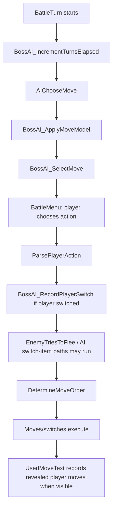

# Boss AI Spec

Date: 2026-02-14
Scope: Trainer AI behavior design for major encounters (leaders, rival, E4, champion)

## Core Policy

Target behavior: **"absurdly strong but non-cheating"**.

AI wins by legal inference and good risk management, not hidden knowledge.

## AI Tiers

### Early Tier (Badges 1-3)

- Uses obvious high-value lines and simple KO checks.
- Limited prediction depth.
- Conservative switching to avoid player confusion spikes.

### Mid Tier (Badges 4-6)

- Adds deny-KO and tempo-aware lines.
- Starts probabilistic prediction from observed player behavior.
- Uses role-aware switching with confidence gates.

### Late Tier (Badges 7-8, E4, Champion)

- Full weighted scoring model enabled.
- Stronger setup punishment and pivot discipline.
- Higher tolerance for advanced lines, but still bounded by no-cheating invariants.

## Move Scoring Model

Per legal move, compute total score:

`Total = KO + DenyKO + Tempo + SetupWindow + StatusValue + RoleBias - Risk`

Scoring components:

- `KO`: large bonus when projected KO chance is high.
- `DenyKO`: bonus for lines that prevent likely player KO next turn (protective/status/utility lines).
- `Tempo`: bonus for maintaining initiative, forcing unfavorable trades, or creating safe pivots.
- `SetupWindow`: bonus for setup only when board is safe enough (no high immediate punish probability).
- `StatusValue`: weighted by target role and encounter phase (sleep/paralysis/burn/poison value differs by context).
- `RoleBias`: mon-specific intended behavior (lead/pivot/wall/breaker/cleaner/ace).
- `Risk`: penalty for low-accuracy or high-self-punish lines unless upside is decisive.

## Switching Logic

### Confidence thresholds

- Evaluate stay-vs-switch confidence each turn.
- Suggested thresholds:
  - Early tier: switch only if confidence to improve board >= `0.80`.
  - Mid tier: >= `0.70`.
  - Late tier: >= `0.60`.

### Anti-loop cooldown

- Any mon that switches out gets a short switch cooldown.
- During cooldown, switching that same mon again requires +0.10 extra confidence.
- Forced exceptions: imminent KO prevention, immunity pivot opportunity, or scripted ace timing.

Goal: prevent repetitive pivot loops while preserving smart tactical switching.

## Prediction Logic

Prediction is probabilistic, never deterministic.

Allowed prediction inputs only:

- Seen player Pokemon species.
- Revealed player moves.
- Observed player switching patterns over the current encounter history.

Forbidden prediction inputs:

- Unseen party members.
- Unrevealed moves/items/stats.
- Future player button input.

Prediction method:

- Build weighted action priors from observed history.
- Sample from top predicted player lines (not single hard counterpick).
- Select AI action by expected value across predicted distribution.

### Current switch prediction formula

Current implementation: `engine/battle/ai/boss.asm`, `BossAI_PredictPlayerSwitch`.

The routine starts from a baseline of `10`, then applies only observed/public
state:

- If committed `wBossAIPlayerSwitchCount * 2 >= wBossAITurnsElapsed`, add `20`.
- Else if the player has switched at least once, add `10`.
- If the player's active Pokemon is not at quarter HP or lower, add `20`.
- If public/observed threat checks say the player plausibly pressures the enemy,
  add `15`.
- If the player has revealed a super-effective damaging move, subtract `10`.
- Cap final predicted switch chance at `80`.

This prediction is intentionally heuristic. Future changes should preserve the
rule that it is based on previous observations and public state, not current
hidden input.

`BossAI_RecordPlayerSwitch` must write current-turn switch observations to
pending state only. `BossAI_IncrementTurnsElapsed` commits that pending state on
the next turn before `BossAI_PredictPlayerSwitch` can consume it.

## Turn-Order Safety

Boss AI timing has a specific cheating hazard: move choice and switch/item
choice do not happen at the same point in the turn.



Safety rules:

- `BossAI_SelectMove` is before player input, so move scoring cannot peek at the
  current player action unless another routine already stored unsafe state.
- `BossAI_RecordPlayerSwitch` runs during `ParsePlayerAction`, before some
  enemy switch/item logic can run later in the same turn.
- Any new state derived from `BossAI_RecordPlayerSwitch` must be pending-only
  until the next `BossAI_IncrementTurnsElapsed`.
- Revealed move tracking is safe only after the move is visibly used. Do not
  infer unrevealed moves from party data or exact private stats.

Key source anchors:

- `engine/battle/core.asm`: `BossAI_IncrementTurnsElapsed`, `AIChooseMove`,
  `BattleMenu`, `ParsePlayerAction`, `BossAI_RecordPlayerSwitch`,
  `DetermineMoveOrder`.
- `engine/battle/ai/move.asm`: `BossAI_ApplyMoveModel`,
  `BossAI_SelectMove`.
- `engine/battle/ai/items.asm`: `AI_SwitchOrTryItem`,
  `BossAI_SwitchOrTryItem`, `BossAI_OnSwitchExecuted`.
- `engine/battle/used_move_text.asm`: `BossAI_RecordRevealedPlayerMove`.
- `engine/battle/read_trainer_attributes.asm`: `LoadBossAITier`,
  `ClearBossAIState`.
- `engine/battle/ai/switch.asm`: legacy enemy switch scoring helpers. Boss
  model code should prefer boss-safe wrappers in `engine/battle/ai/boss.asm`.

## Player Knowledge Model Quick Trace

Use this route for questions about how boss AI knows, remembers, or infers
player Pokemon and player moves. The important distinction is that boss AI
tracks exact seen species, but it tracks player move knowledge mostly as threat
types, not as hidden exact moves.

Send-out path:

- `engine/battle/core.asm`: `BattleMonEntrance` calls `NewBattleMonStatus`.
- `NewBattleMonStatus` clears the active-mon `wPlayerUsedMoves` list, then calls
  `BossAI_RecordPlayerSpecies`.
- `engine/battle/ai/boss.asm`: `BossAI_RecordPlayerSpecies` appends only the
  active `wBattleMonSpecies` to `wBossAISeenPlayerSpecies`.

Visible move reveal path:

- `engine/battle/used_move_text.asm`: `UsedMoveText` updates `wPlayerUsedMoves`
  only when a player move is visibly used, then calls
  `BossAI_RecordRevealedPlayerMove`.
- `BossAI_RecordRevealedPlayerMove` finds the active species slot with
  `BossAI_GetActiveSpeciesRevealedMaskPointer`.
- `BossAI_AddRevealedMoveToSpeciesMask` stores the revealed damaging move type
  in that species' 4-byte mask. Hidden Power sets
  `BOSS_AI_PLAUSIBLE_HP_RISK_BIT`; status moves are not stored as threat types.
- Runtime storage is `wBossAIRevealedMovesBitmap`: six 4-byte per-seen-species
  revealed type masks. The old spare bytes in that reserve include
  `wBossAILikelyTypeMaskCache`, a 4-byte active-species confidence mask.

Plausible move inference path:

- `BossAI_ApplyMoveModel` and `BossAI_SwitchOrTryItem` both call
  `BossAI_ComputePlayerPlausibleTypeMask` before using plausible player threat
  knowledge.
- `BossAI_ComputePlayerPlausibleTypeMask` builds `wBossAIPlausibleTypeMaskCache`
  from public active species facts: current STAB types, per-species revealed
  damaging move types, active-species and pre-evolution-chain legal TM/HM
  learnability, active-species and pre-evolution-chain level-up moves at or
  below `wBattleMonLevel`, and active-species and pre-evolution-chain egg moves.
- The companion `wBossAILikelyTypeMaskCache` marks higher-confidence threats:
  STAB, revealed damaging move types, and current-species level-up moves at or
  below `wBattleMonLevel`. TM/HM coverage, egg moves, and pre-evolution-only
  moves remain possible but are weighted as speculative coverage.
- `BossAI_AddMoveIdToPlausibleMask` ignores non-damaging moves, ignores
  damaging moves below `BOSS_AI_PLAUSIBLE_MIN_POWER`, stores regular damaging
  moves by type, and stores Hidden Power as the special HP risk bit.
- `BossAI_GetPrimaryThreatType`, `BossAI_ShouldScout`,
  `BossAI_RefineSwitchCandidateForPlausibleRisk`, and
  `BossAI_ApplyPlausibleRiskToSwitchConfidence` are the main consumers.
- Switch risk scans likely threats at the normal tier weight and scans
  possible-only threats at half that weight. Possible-only threats can still
  drive scouting or matter on 4x matchups, but they should not dominate the same
  way as revealed, STAB, or current-level-up threats.

Review rule: a fresh switch-in may justify species/level/type/legal-learnset
plausible threat inference, but it must not justify reading the player's actual
unrevealed four move slots, hidden party slots, held items, or private stats.

### Plausible Threat Edit Map

Use this map before changing player-move inference or switch-risk behavior. It
captures the boundaries that are easy to forget mid-edit.

Core mental model:

- `wBossAIPlausibleTypeMaskCache` means "this damaging type is legal enough to
  respect."
- `wBossAILikelyTypeMaskCache` means "this damaging type is a higher-confidence
  threat."
- Likely must be a subset of possible. Revealed damaging move types and STAB go
  into both masks. Current-species level-up moves at or below `wBattleMonLevel`
  go into both masks. TM/HM coverage, egg moves, and pre-evolution-only moves go
  into possible only.
- Hidden Power uses `BOSS_AI_PLAUSIBLE_HP_RISK_BIT`; treat possible-only Hidden
  Power as scout pressure, not the same panic level as revealed or likely HP.

State and cache rules:

- `BossAI_RecordRevealedPlayerMove` invalidates
  `wBossAIPlausibleTypeMaskSpecies` and `wBossAIPlausibleTypeMaskLevel`, so the
  next consumer recomputes both possible and likely masks.
- `BossAI_ClearPlausibleMask` must clear both masks together.
- `BossAI_AddSpeciesAndPreEvolutionMovesToMask` temporarily mutates
  `wCurPartySpecies`, `wCurSpecies`, and base data while walking pre-evolutions;
  it must restore the active species and call `GetBaseData` before returning.
- Avoid using `wBossAITemp3` across helper calls inside switch-candidate
  refinement; that byte also holds the current best switch candidate. Prefer
  stack preservation for tiny one-byte saves in nested plausible-risk helpers.

Review traps:

- Do not read `wBattleMonMoves`, `wBattleMonPP`, `wBattleMonItem`, player party
  structs, or current input to make boss decisions. The legal source for
  unrevealed move inference is public species/level plus move tables.
- Do not return early from level-up learnset scans just because one move is above
  the active level; learnsets may not be sorted the way the shortcut assumes.
- If new code is inserted into `BossAI_ComputeSwitchCandidateRisk`, recheck local
  `jr` ranges. This function is large enough that short branches can silently
  become link-time failures.
- If a helper changes `hBattleTurn` for type-matchup simulation, restore it on
  every exit path.

Fast verification for this area:

```powershell
python tools\audit\check_boss_ai_no_cheat.py
python tools\audit\check_boss_ai_gating.py
python tools\audit\check_boss_ai_trace_invariants.py
python tools\audit\check_boss_ai_memory_budget.py
python tools\audit\check_docs_navigation.py
```

## Legacy AI Scoring Interaction

Current implementation: boss trainers skip the normal AI scoring layers in
`engine/battle/ai/move.asm` and jump directly to the boss model when
`wBossAITier != 0`.

Rules:

- Keep boss move selection on the boss model unless legacy scoring has been
  audited for hidden-information reads.
- If a legacy helper needs private player information for ordinary trainers,
  gate that helper off for boss tiers or replace it with public/observed state.
- `AI_Smart_MeanLook` defensively skips `AICheckLastPlayerMon` for boss tiers
  because that helper scans hidden player party HP.
- If normal scoring is ever re-enabled for boss tiers, re-audit
  `engine/battle/ai/scoring.asm` before relying on it.

## Boss-Safe Decision Helpers

The boss model should use wrappers that avoid exact private player stats and
hidden party information:

- `BossAI_CurrentEnemyMoveHasKOPressure`: heuristic KO pressure from move power,
  public typing, STAB, type matchup, and coarse public HP bands.
- `BossAI_CurrentEnemyMovePressureScore`: shared pressure score used by move
  scoring and lookahead.
- `BossAI_PlayerHasPublicThreatVsEnemy`: revealed player moves first, then
  current public typing as a fallback.
- `BossAI_PublicEnemyFaster`: public species base-speed estimate, not exact
  runtime speed stats.
- `BossAI_CheckPlayerMoveTypeMatchupVsEnemyNoItem` and
  `BossAI_CheckEnemyMoveTypeMatchupVsPlayerNoItem`: type matchup without held
  item peeking.
- `BossAI_CheckAbleToSwitchSafe`: boss switch candidate check that avoids
  player hidden-information scoring.

Treat direct boss-model calls to `AIDamageCalc`, `AICompareSpeed`, or
`CheckPlayerMoveTypeMatchups` as suspect unless the caller is clearly ordinary
AI or battle resolution rather than boss decision knowledge.

## Runtime State Budget

Boss AI runtime state lives in `ram/wram.asm`, in WRAMX bank 1, because battle
code reads and writes it directly without WRAM bank switching.

Reserved block:

- Start: `wBossAITier`.
- Normal-build logical end: `wBossAIStateEnd`.
- Reserved size: `140` bytes, enforced by
  `ds 140 - (wBossAIStateEnd - wBossAITier)`.
- Current normal build: `wBossAITier = 01:d72b`,
  `wBossAIStateEnd = 01:d776`, so normal state uses `75` bytes and leaves `65`
  reserved bytes.
- Current trace field set adds `19` bytes under `BOSS_AI_TRACE`, so trace state
  would use `94` bytes and leave `46` reserved bytes.

Adding 2-3 bytes to this block is acceptable in principle, but every change must
still be build-verified because WRAMX overall has no free unreserved space.
Never move save-compatible or unrelated WRAM fields casually to make room.
For exact current addresses and byte counts, treat `docs/generated/dev_index.md`
as the source of truth; refresh it after linker outputs change.

## Implementation Checklist For Boss AI Changes

- Confirm the new signal is legal public or previously observed information.
- Decide whether the signal is same-turn unsafe. If yes, commit it only at the
  next `BossAI_IncrementTurnsElapsed`.
- Update or inspect `ClearBossAIState` coverage if adding fields.
- Check `AIChooseMove`, `AI_SwitchOrTryItem`, and execution flow for both player
  and enemy timing.
- Verify bank `0e` size and avoid moving logic into tight `Battle Core` bank
  `0f` unless necessary.
- Refresh `docs/generated/dev_index.md` after a build changes symbols.

## Known Remaining Fairness Risk

Exact battle helpers such as `AIDamageCalc` and `AICompareSpeed` remain in the
legacy AI code and battle engine. Those helpers use exact active Pokemon stats,
including private player stat values. That is stronger than a human-like
estimate when used for boss decision knowledge.

Future fix direction:

- Add boss-safe damage and speed estimators based on public species, level,
  typing, stat stages, revealed moves, and observed damage ranges.
- Keep exact helpers for ordinary AI or internal battle resolution, but do not
  use them for boss decision knowledge unless the exact value has become public
  through observed turn order or damage.
- Treat any new direct boss-model call to those exact helpers as a review
  finding unless it is deliberately documented and justified.

## Explicit No-Cheating Invariants

- AI cannot read hidden player party slots.
- AI cannot read unrevealed moves, held items, or private stat data.
- AI cannot peek player input before action lock.
- AI cannot alter RNG outcomes after decision.
- AI cannot bypass normal PP, priority, accuracy, or legality checks.
- AI cannot execute illegal move/item combinations.
- AI and player run on the same battle ruleset and damage model.

## Logging and Tuning Hooks (Design)

- Emit per-turn debug trace in development builds:
  - top 3 move scores
  - switch confidence
  - prediction distribution
  - chosen action + reason code
- Use traces to tune weights per tier without changing no-cheating invariants.
