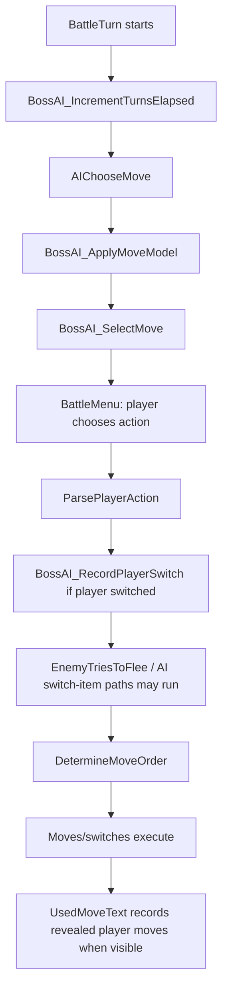

# Boss AI Spec

## Boss AI Cognition Mode

This spec is a launchpad, not a leash. Think like a brutal human opponent:
five-turn clocks, sacrifice lines, bait, counter-bait, setup windows, and "I
know that you know" loops. Journal the crazy version first; only implement the
part that stays fair, public-information-only outside explicitly authored Haki
branches, memory-budgeted, and testable.

Date: 2026-02-14
Scope: Trainer AI behavior design for major encounters (leaders, rival, E4, champion)

## Core Policy

Target behavior: **"absurdly strong but non-cheating"**.

AI wins by legal inference and good risk management, not hidden knowledge.

## Haki Exception Contract

Haki is the only intentional exception to the no-cheat rule. It is one
unfair, dramatic intervention per battle, available to 19 named bosses. The
discipline is not making Haki fair; the discipline is **quarantining** it so
the rest of Boss AI stays public-information-only.

Hard rules:

- **One activation per battle.** Cleared by `ClearBossAIState`. Trace fields
  under `BOSS_AI_TRACE` must record the fire.
- **Player-invisible.** No text, animation, palette, aura, status, weather,
  screen, or impossible visible outcome. The player only ever sees an
  ordinary-looking move from the boss.
- **Late-tier or major bosses only.** Falkner, Bugsy, and Whitney
  intentionally have no Haki; their Boss AI must stay legal and
  public-information-only so the early game teaches the rulebook before
  loopholes appear.
- **One trigger, one fire, one outcome.** No "fires on hinge A *or* hinge
  B" tuning. New trainer = new entry; no shared smart helpers.

## The Single Haki Type: Oracle

Every Haki leader uses the same Haki shape. On the first turn the leader's
ace mon is active, the boss runs move scoring with the player's locked-in
action as known input. The boss reads the player's selected move
(post-`ParsePlayerAction`), scores the ace's moves with that information,
picks the chosen move, sets the spent flag, and returns. Haki does not
switch or use items.

If the ace is never sent out (the player sweeps the rest of the team
first), Haki goes unspent. This is correct — Haki is a specific moment,
not a generic boost.

Per-leader identity (Morty's Destiny Bond moment, Karen's Pursuit punish,
Lance's Hyper Beam pivot, etc.) lives in the **ace's moveset and Boss AI
scoring**, not in bespoke Haki predicates. Authoring discipline: the ace's
4 moves should already contain the right answers; Oracle just supplies the
input read that lets normal scoring pick the right one.

### Per-Leader Roster

Falkner, Bugsy, and Whitney are intentionally absent.

| Leader | Ace | Ace level | Iconic move on ace |
| --- | --- | --- | --- |
| Morty | Gengar | 26 | Destiny Bond |
| Chuck | Poliwrath | 34 | Focus Punch |
| Jasmine | Steelix | 34 | Earthquake |
| Pryce | Piloswine | 34 | Earthquake |
| Clair | Dragonite | 39 | Outrage |
| Will | Xatu | 43 | Future Sight |
| Koga | Crobat | 44 | Hyper Beam |
| Bruno | Machamp | 46 | Cross Chop |
| Karen | Houndoom | 47 | Crunch |
| Lance | Dragonite | 50 | Hyper Beam |
| Brock | Golem | 60 | Earthquake |
| Misty | Starmie | 63 | Hydro Pump |
| Lt. Surge | Raichu | 65 | Cross Chop |
| Erika | Victreebel | 64 | Sludge Bomb |
| Janine | Venomoth | 64 | Sleep Powder |
| Sabrina | Alakazam | 67 | Psychic |
| Blaine | Magmar | 65 | Fire Blast |
| Blue | Arcanine | 70 | Outrage |
| Red | Pikachu | 81 | ExtremeSpeed |

Ace selection rule: **highest-level party member.** On tied highest level,
the later party slot wins. This rule is explicit so the implementation can
identify the ace deterministically without a per-leader marker.

The "iconic move on ace" column is descriptive, not load-bearing — Oracle
doesn't gate on a specific move. It documents the authored fantasy so
future roster changes can preserve identity.

## Hook Site

One hook covers Oracle Haki entirely.

**Haki dispatch** — top of `BossAI_SwitchOrTryItem`, after
`ParsePlayerAction` has populated player intent and before normal
KO-pressure early returns. The dispatch:

1. Returns immediately if `wHakiSpent != 0`.
2. Returns immediately if the active boss mon is not the trainer's ace
   (per the ace selection rule above).
3. Returns immediately if this is not the ace's first turn active in the
   battle.
4. Reads the player's locked move via `wCurPlayerMove` (or equivalent
   post-`ParsePlayerAction` slot).
5. Calls Boss AI move scoring with the locked move available as known
   input.
6. Writes the chosen move via `wCurEnemyMove` / `wCurEnemyMoveNum`.
7. Sets `wHakiSpent`, writes trace fields, returns nonzero with carry
   clear.

Implementation rules:

- Inherit caller safety gates. Haki must not run in link/wild battles.
- Never store the player's selected move, exact damage, hidden item,
  hidden party facts, or other private facts outside explicit trace
  fields.
- The "first turn active" check needs a per-battle bit recording whether
  the ace has been seen alive in a previous turn. Reuse existing
  active-mon tracking if available; otherwise add 1 byte.

## Trace Contract

Under `BOSS_AI_TRACE`, every Haki fire must be visible in trace output:

```
haki_fired turn=N trainer=<class>:<id> ace=<species> chosen_move=<move>
```

The current trace system records the Morty prototype with
`wBossAITraceChosenMove` and `wBossAITraceRiskFlags` bit 3
(`haki-oracle-fired`). Future agents reading
`audit/boss_ai_trace/*_live.txt` can see exactly which boss decision was
input-aware vs public-information-only.

## Runtime State Cost

The Haki feature adds one byte (or two if first-turn detection needs its
own slot) to the existing Boss AI WRAM reserve:

- `wHakiSpent` — 1 byte. Non-zero once per battle after Haki has fired.
  Cleared by `ClearBossAIState`.
- `wHakiAceFirstTurnSeen` — 1 byte (optional). Non-zero after the ace has
  been the active mon for at least one turn. Used to enforce the
  "first turn active" gate. May be omitted if existing active-mon turn
  counters already cover this.

Current implementation note (2026-05-14): the Morty/Gengar prototype does not
add WRAM. It packs spent / ace-seen / current-turn eligibility bits into
`wBossAIRevealedMovesBitmapSpare` byte 1 and uses existing trace fields plus
`wBossAITraceRiskFlags` bit 3. A generic all-leader rollout still needs a fresh
memory review because priority-changing Oracle choices require a pre-order hook
or an equal-priority-only contract.

For exact addresses and current free-byte counts, see the Runtime State
Budget section below.

## Implementation Order

Land Haki one leader at a time, with trace proof, audit-script clean-up,
and release-smoke verification between each:

1. **Morty** (Gengar's first turn) — cleanest first prototype. Gengar's
   moveset makes the input-read-then-rescore behavior visibly distinct:
   with Haki, Gengar fires Destiny Bond on lethal incoming; without, it
   picks a normal coverage move. Easy to confirm in trace.
2. **Lance** (Dragonite's first turn) — second test. Champion-tier
   trainer-class gating exercises the `CHAMPION:LANCE` constant pair
   (different gating shape than gym leaders).
3. **One mid-tier leader** (Misty or Surge suggested) — proves the
   ace-detection logic works for trainers whose ace recently changed.
4. Remaining 16 leaders may be added in any order once these three are
   stable.

Do not implement this as a compiled all-leader Haki table on day one.
Each leader needs trace proof, memory proof, no player-visible tell, and
a release-smoke check, before the next one ships.

## Post-Input Oracle Move Override Contract

The Oracle dispatch must follow the same legality discipline as any
move-choice cheat.

Allowed shape:

- Call only from the post-input window at the top of
  `BossAI_SwitchOrTryItem`, after `BossAI_SelectPlanIfNeeded` /
  `BossAI_ComputePlayerPlausibleTypeMask` and before normal KO-pressure
  early returns.
- Inherit the caller's safety gates. The override must not run in
  link/wild battles or while enemy lock, trapping, or wrap checks have
  already rejected action changes.
- Return zero with carry clear for no Haki; return nonzero with carry clear
  after writing a chosen move. Never return carry, because carry means
  switch/item to battle flow.
- Gate on player action already being locked, such as
  `wBattlePlayerAction == BATTLEPLAYERACTION_USEMOVE`, and keep current-turn
  reads inside the spent Haki branch only.
- For Destiny Bond-style Oracle plays, require legal timing such as
  `wEnemyGoesFirst != 0`; Haki may not make Destiny Bond retroactive.
- On override, write `wCurEnemyMove` / `wCurEnemyMoveNum`, set `wHakiSpent`
  before returning, update trace fields, and keep chosen-move/repeat memory
  consistent with the actual move.
- Do not store the selected player move, exact damage, hidden item, hidden
  party facts, or other private facts anywhere outside explicit trace/Haki
  reason fields.

## First-Playthrough Boss Promise

Bosses exist to restore the childhood feeling that a gym leader might actually
beat you. They should feel prepared, observant, and dangerous, but never
clairvoyant. The player should lose because a leader played the public board
well, punished autopilot, or made a risky line credible, not because the ROM
read hidden party data or current-turn input.

The goal is scary Johto, not competitive perfection. Prefer readable pressure,
probabilistic prediction, and role identity over deterministic scripts or
omniscient counterplay.

## AI Tiers

### Early Tier (Badges 1-3)

- Uses obvious high-value lines and simple KO checks.
- Limited prediction depth.
- Conservative switching to avoid player confusion spikes.

### Mid Tier (Badges 4-6)

- Adds deny-KO and tempo-aware lines.
- Starts probabilistic prediction from observed player behavior.
- Uses role-aware switching with confidence gates.

### Late Tier (Badges 7-8, E4, Champion)

- Full weighted scoring model enabled.
- Stronger setup punishment and pivot discipline.
- Higher tolerance for advanced lines, but still bounded by no-cheating invariants.

## Move Scoring Model

Per legal move, compute total score:

`Total = KO + DenyKO + Tempo + SetupWindow + StatusValue + RoleBias - Risk`

Scoring components:

- `KO`: large bonus when projected KO chance is high.
- `DenyKO`: bonus for lines that prevent likely player KO next turn (protective/status/utility lines).
- `Tempo`: bonus for maintaining initiative, forcing unfavorable trades, or creating safe pivots.
- `SetupWindow`: bonus for setup only when board is safe enough (no high immediate punish probability).
- `StatusValue`: weighted by target role and encounter phase (sleep/paralysis/burn/poison value differs by context).
- `RoleBias`: mon-specific intended behavior (lead/pivot/wall/breaker/cleaner/ace).
- `Risk`: penalty for low-accuracy or high-self-punish lines unless upside is decisive.

Current public trade traps:

- `engine/battle/ai/boss_platform.asm:1419`, `.ApplyDestinyBondTradeBias`.
- Mid/late bosses may value Destiny Bond when the boss is visibly at quarter HP
  or lower, has no KO line, the active player has a public threat, and the boss
  is publicly faster.
- This is a pressure read, not input reading. It must not inspect the player's
  selected move, hidden moves/items, hidden reserves, damage rolls, or RNG.
- `engine/battle/ai/boss_platform.asm:1439`, `.ApplyRevealedDestinyBondAvoidance`.
- Mid/late bosses may penalize KO-pressure moves into the active player after
  that active player has exactly revealed Destiny Bond, is visibly at quarter HP
  or lower, and public base-speed logic says the boss does not move first. This
  is delayed public move memory, not current-turn intent reading.
- `engine/battle/ai/boss_platform.asm:1458`, `.ApplyCounterCoatTradeBias`.
- Mid/late bosses may value Counter or Mirror Coat when the active player has
  already revealed a damaging move of the matching public type category, the
  boss has no KO line, the active player has public threat, the boss is not
  publicly faster, and the reflected move can hit the player's visible typing.
- The Counter/Mirror Coat model uses revealed move type category only. It must
  not call effective-category helpers that inspect hidden player stats, and it
  must not inspect the player's selected move this turn.
- `engine/battle/ai/boss_policy_move.asm:875`, `BossAI_CurrentEnemyMoveScoredPower`.
- Flail/Reversal store `MOVE_POWER = 1` until their battle effect rewrites
  power from the user's HP. Boss scoring treats the boss's own public HP bands
  as pressure thresholds instead: at quarter HP or lower they score as high
  pressure, and at half HP or lower they score as mid pressure.
- This is legal because it uses only the boss's own HP band, own current move
  effect, and the existing public matchup pipeline. It must not inspect the
  player's current-turn choice, hidden moves/items, hidden reserves, RNG futures,
  or exact future damage rolls.

## Decision Breadth And Play Budget

The AI should notice more options than it deeply calculates.

Use three layers:

- Raw legal buttons: score every legal move and every relevant legal switch the
  current architecture can see.
- Strategic candidates: project only the few plays that can decide the turn.
- Reply buckets: model coarse player responses, not exact hidden intent.

Current source caps:

- `NUM_MOVES = 4`.
- `BOSS_AI_LOOKAHEAD_N = 4`.
- `BOSS_AI_LOOKAHEAD_M = 3`.
- `BOSS_AI_LOOKAHEAD_HORIZON_MID = 4`.
- `BOSS_AI_LOOKAHEAD_HORIZON_LATE = 5`.
- `BOSS_AI_SWITCH_CANDIDATE_CAP = 4`.

Target behavior:

- Early bosses: deeply consider 2 plays, with 1-2 coarse reply buckets.
- Mid bosses: deeply consider 3 plays, with 2 coarse reply buckets and a
  4-turn horizon.
- Late bosses, Elite Four, Lance, Red, and other major endgame bosses: deeply
  consider 4 plays, with 3 coarse reply buckets and a 5-turn horizon.

The late-boss four-play shape is:

1. Best forcing line.
2. Safest non-losing line.
3. Greed, setup, status, or resource line.
4. Counter-read line: the "I know you know" play.

Do not expand this into broad literal game-tree search. For example, 8 immediate
actions times 4 player replies over 5 turns is already more than 33 million
terminal branches. That is not human-like; it is fantasy search. Strong boss AI
should cheaply score the visible board, keep a small beam of credible plays,
project through coarse reply buckets, then let plan identity and risk decide
close calls.

If `BOSS_AI_LOOKAHEAD_M` is used in a future implementation, prefer using it for
the 3 player reply buckets: stay/attack, preserve/switch, and greed/setup. Do
not use it to add more AI candidate plays unless a concrete trace proves that
the fourth candidate beam is hiding a real boss-quality line.

## Switching Logic

### Confidence thresholds

- Evaluate stay-vs-switch confidence each turn.
- Suggested thresholds:
  - Early tier: switch only if confidence to improve board >= `0.80`.
  - Mid tier: >= `0.70`.
  - Late tier: >= `0.60`.

### Anti-loop cooldown

- Any mon that switches out gets a short switch cooldown.
- During cooldown, switching that same mon again requires +0.10 extra confidence.
- Forced exceptions: imminent KO prevention, public Perish Song escape,
  immunity pivot opportunity, or scripted ace timing.

Goal: prevent repetitive pivot loops while preserving smart tactical switching.

### Current public revenge denial

Current implementation: `engine/battle/ai/boss_policy_switch.asm:170`,
`BossAI_ShouldRespectPotentialPlayerRevenge`.

When a boss has a KO-pressure move, `BossAI_SwitchOrTryItem` normally stays in
and takes the prize. The exception is when public state says the KO may open a
revenge door:

- The active player has a public/revealed threat into the boss.
- The boss is in a public HP band where that threat matters.
- A suspicious fresh switch-in suggests the player entered a coverage/pivot
  line.
- For mid and late bosses, already-seen bench species can also count as a
  revenge warning if they are still publicly alive and their public STAB types
  threaten the current boss. Two or more such seen bench species are enough by
  themselves; one seen bench species matters when the boss is at half HP or
  lower.

This is not hidden party reading. The seen-species branch uses only species that
have already appeared in battle, public faint/send-out events, public base
types, the boss's current public HP band, and the existing type-matchup helper.
It must not infer unseen reserve species, hidden reserve HP, hidden player
items, hidden exact moves, or current-turn player intent.

### Current public Perish Song escape

Current implementation: `engine/battle/ai/boss_policy_switch.asm:154`,
`BossAI_EnemyPerishEscapeUrgent`.

When the boss's own active mon is publicly under Perish Song and
`wEnemyPerishCount` is `1` or `2`, `BossAI_SwitchOrTryItem` may bypass the usual
"take the KO and stay" gate and try to switch. `BossAI_ComputeSwitchConfidence`
also adds a strong `+40` confidence bonus, capped at `99`, before ordinary
player-switch prediction. The A->B->A loop penalty treats this as a public
emergency exception.

This is legal because it reads only the boss's own visible perish substatus and
count. It must not infer whether the player will re-trap, click Perish Song
again, or reveal a hidden trapping move. The whole point is simpler and meaner:
a boss that can hear its own death clock should not sit there taking a shiny KO
while the clock wins the battle.

## Prediction Logic

Prediction is probabilistic, never deterministic.

Allowed prediction inputs only:

- Seen player Pokemon species.
- Revealed player moves.
- Observed player switching patterns over the current encounter history.

Forbidden prediction inputs:

- Unseen party members.
- Unrevealed moves/items/stats.
- Future player button input.

Prediction method:

- Build weighted action priors from observed history.
- Sample from top predicted player lines (not single hard counterpick).
- Select AI action by expected value across predicted distribution.

### Current switch prediction formula

Current implementation: `engine/battle/ai/boss_policy_switch.asm:474`, `BossAI_PredictPlayerSwitch`.

The routine starts from a baseline of `10`, then applies only observed/public
state:

- If committed `wBossAIPlayerSwitchCount * 2 >= wBossAITurnsElapsed`, add `20`.
- Else if the player has switched at least once, add `10`.
- If the player's active Pokemon is not at quarter HP or lower, add `20`.
- If public/observed threat checks say the player plausibly pressures the enemy,
  add `15`.
- If the player has revealed a super-effective damaging move, subtract `10`.
- Cap final predicted switch chance at `80`.

This prediction is intentionally heuristic. Future changes should preserve the
rule that it is based on previous observations and public state, not current
hidden input.

`BossAI_RecordPlayerSwitch` must write current-turn switch observations to
pending state only. `BossAI_IncrementTurnsElapsed` commits that pending state on
the next turn before `BossAI_PredictPlayerSwitch` can consume it.

## Turn-Order Safety

Boss AI timing has a specific cheating hazard: move choice and switch/item
choice do not happen at the same point in the turn.



Safety rules:

- `BossAI_SelectMove` is before player input, so move scoring cannot peek at the
  current player action unless another routine already stored unsafe state.
- `BossAI_RecordPlayerSwitch` runs during `ParsePlayerAction`, before some
  enemy switch/item logic can run later in the same turn.
- Any new state derived from `BossAI_RecordPlayerSwitch` must be pending-only
  until the next `BossAI_IncrementTurnsElapsed`.
- Revealed move tracking is safe only after the move is visibly used. Do not
  infer unrevealed moves from party data or exact private stats.

Key source anchors:

- `engine/battle/core.asm`: `BossAI_IncrementTurnsElapsed`, `AIChooseMove`,
  `BattleMenu`, `ParsePlayerAction`, `BossAI_RecordPlayerSwitch`,
  `DetermineMoveOrder`.
- `engine/battle/ai/move.asm`: `BossAI_ApplyMoveModel`,
  `BossAI_SelectMove`.
- `engine/battle/ai/items.asm`: `AI_SwitchOrTryItem`,
  `BossAI_SwitchOrTryItem`, `BossAI_OnSwitchExecuted`.
- `engine/battle/used_move_text.asm`: `BossAI_RecordRevealedPlayerMove`.
- `engine/battle/read_trainer_attributes.asm`: `LoadBossAITier`,
  `ClearBossAIState`.
- `engine/battle/ai/switch.asm`: legacy enemy switch scoring helpers. Boss
  model code should prefer boss-safe wrappers in `engine/battle/ai/boss_platform.asm`.

## Player Knowledge Model Quick Trace

Use this route for questions about how boss AI knows, remembers, or infers
player Pokemon and player moves. The important distinction is that boss AI
tracks exact seen species, but it tracks player move knowledge mostly as threat
types, not as hidden exact moves.

Send-out path:

- `engine/battle/core.asm`: `BattleMonEntrance` calls `NewBattleMonStatus`.
- `NewBattleMonStatus` calls `BossAI_LoadPlayerUsedMovesForActiveSpecies` to
  populate `wPlayerUsedMoves` with the entering active mon's per-species memory
  (preserved across same-fight switches via `wBossAISpeciesUsedMoves`); the
  helper falls back to the original blanket-zero behavior outside boss fights
  and on first-time encounters. It then calls `BossAI_RecordPlayerSpecies`.
- `engine/battle/ai/boss_platform.asm:53`: `BossAI_RecordPlayerSpecies` appends only the
  active `wBattleMonSpecies` to `wBossAISeenPlayerSpecies` and marks that seen
  species slot alive in `wBossAISeenPlayerAliveMask`.
- `engine/battle/core.asm`: `UpdateFaintedPlayerMon` calls
  `BossAI_RecordPlayerFaint`.
- `BossAI_RecordPlayerFaint` clears only the matching seen-species alive bit
  after the active player Pokemon visibly faints.

Visible move reveal path:

- `engine/battle/used_move_text.asm`: `UsedMoveText` updates `wPlayerUsedMoves`
  only when a player move is visibly used, then calls
  `BossAI_RecordRevealedPlayerMove`.
- `BossAI_RecordRevealedPlayerMove` finds the active species slot with
  `BossAI_GetActiveSpeciesRevealedMaskPointer`.
- `BossAI_AddRevealedMoveToSpeciesMask` stores the revealed damaging move type
  in that species' 4-byte mask. Hidden Power sets
  `BOSS_AI_PLAUSIBLE_HP_RISK_BIT`; status moves are not stored as threat types.
- After the bitmap update, `BossAI_MirrorPlayerUsedMovesToSpeciesSlot` copies
  the active `wPlayerUsedMoves` list into the matching slot of
  `wBossAISpeciesUsedMoves`, keeping the per-species mirror in sync with each
  visible move use.
- Runtime storage is `wBossAIRevealedMovesBitmap`: six 4-byte per-seen-species
  revealed type masks. The old spare bytes around that reserve include
  `wBossAILikelyTypeMaskCache`, a 4-byte active-species confidence mask,
  `wBossAISeenPlayerAliveMask`, a 1-byte public alive mask for seen species
  slots, and 3 bytes of spare reserve. Adjacent to the reserve, after the temp
  bytes, lives `wBossAITierWeightRow` (1 byte; ramp index into
  `BossAITierWeights`) and `wBossAISpeciesUsedMoves`
  (`PARTY_LENGTH * NUM_MOVES = 24` bytes).

Plausible move inference path:

- `BossAI_ApplyMoveModel` and `BossAI_SwitchOrTryItem` both call
  `BossAI_ComputePlayerPlausibleTypeMask` before using plausible player threat
  knowledge.
- `BossAI_ComputePlayerPlausibleTypeMask` builds `wBossAIPlausibleTypeMaskCache`
  from public active species facts: current STAB types, per-species revealed
  damaging move types, active-species and pre-evolution-chain legal TM/HM
  learnability, active-species and pre-evolution-chain level-up moves at or
  below `wBattleMonLevel`, and active-species and pre-evolution-chain egg moves.
- The companion `wBossAILikelyTypeMaskCache` marks higher-confidence threats:
  STAB, revealed damaging move types, and current-species level-up moves at or
  below `wBattleMonLevel`. TM/HM coverage, egg moves, and pre-evolution-only
  moves remain possible but are weighted as speculative coverage.
- `BossAI_AddMoveIdToPlausibleMask` ignores non-damaging moves, ignores
  damaging moves below `BOSS_AI_PLAUSIBLE_MIN_POWER`, stores regular damaging
  moves by type, and stores Hidden Power as the special HP risk bit.
- `BossAI_GetPrimaryThreatType`, `BossAI_ShouldScout`,
  `BossAI_RefineSwitchCandidateForPlausibleRisk`, and
  `BossAI_ApplyPlausibleRiskToSwitchConfidence` are the main consumers.
- Switch risk scans likely threats at the normal tier weight and scans
  possible-only threats at half that weight. Possible-only threats can still
  drive scouting or matter on 4x matchups, but they should not dominate the same
  way as revealed, STAB, or current-level-up threats.

Review rule: a fresh switch-in may justify species/level/type/legal-learnset
plausible threat inference, but it must not justify reading the player's actual
unrevealed four move slots, hidden party slots, held items, or private stats.

### Plausible Threat Edit Map

Use this map before changing player-move inference or switch-risk behavior. It
captures the boundaries that are easy to forget mid-edit.

Core mental model:

- `wBossAIPlausibleTypeMaskCache` means "this damaging type is legal enough to
  respect."
- `wBossAILikelyTypeMaskCache` means "this damaging type is a higher-confidence
  threat."
- Likely must be a subset of possible. Revealed damaging move types and STAB go
  into both masks. Current-species level-up moves at or below `wBattleMonLevel`
  go into both masks. TM/HM coverage, egg moves, and pre-evolution-only moves go
  into possible only.
- Hidden Power uses `BOSS_AI_PLAUSIBLE_HP_RISK_BIT`; treat possible-only Hidden
  Power as scout pressure, not the same panic level as revealed or likely HP.

State and cache rules:

- `BossAI_RecordRevealedPlayerMove` invalidates
  `wBossAIPlausibleTypeMaskSpecies` and `wBossAIPlausibleTypeMaskLevel`, so the
  next consumer recomputes both possible and likely masks.
- `BossAI_ClearPlausibleMask` must clear both masks together.
- `BossAI_AddSpeciesAndPreEvolutionMovesToMask` temporarily mutates
  `wCurPartySpecies`, `wCurSpecies`, and base data while walking pre-evolutions;
  it must restore the active species and call `GetBaseData` before returning.
- Avoid using `wBossAITemp3` across helper calls inside switch-candidate
  refinement; that byte also holds the current best switch candidate. Prefer
  stack preservation for tiny one-byte saves in nested plausible-risk helpers.

Review traps:

- Do not read `wBattleMonMoves`, `wBattleMonPP`, `wBattleMonItem`, player party
  structs, or current input to make boss decisions. The legal source for
  unrevealed move inference is public species/level plus move tables.
- Do not return early from level-up learnset scans just because one move is above
  the active level; learnsets may not be sorted the way the shortcut assumes.
- If new code is inserted into `BossAI_ComputeSwitchCandidateRisk`, recheck local
  `jr` ranges. This function is large enough that short branches can silently
  become link-time failures.
- If a helper changes `hBattleTurn` for type-matchup simulation, restore it on
  every exit path.

Fast verification for this area:

```powershell
python tools\audit\check_boss_ai_no_cheat.py
python tools\audit\check_boss_ai_gating.py
python tools\audit\check_boss_ai_trace_invariants.py
python tools\audit\check_boss_ai_memory_budget.py
python tools\audit\check_docs_navigation.py
```

## Legacy AI Scoring Interaction

Current implementation: boss trainers skip the normal AI scoring layers in
`engine/battle/ai/move.asm` and jump directly to the boss model when
`wBossAITier != 0`.

Rules:

- Keep boss move selection on the boss model unless legacy scoring has been
  audited for hidden-information reads.
- If a legacy helper needs private player information for ordinary trainers,
  gate that helper off for boss tiers or replace it with public/observed state.
- `AI_Smart_MeanLook` defensively skips `AICheckLastPlayerMon` for boss tiers
  because that helper scans hidden player party HP.
- If normal scoring is ever re-enabled for boss tiers, re-audit
  `engine/battle/ai/scoring.asm` before relying on it.

## Boss-Safe Decision Helpers

The boss model should use wrappers that avoid exact private player stats and
hidden party information:

- `BossAI_CurrentEnemyMoveHasKOPressure`: heuristic KO pressure from move power,
  public typing, STAB, type matchup, and coarse public HP bands.
- `BossAI_CurrentEnemyMovePressureScore`: shared pressure score used by move
  scoring and lookahead.
- `BossAI_PlayerHasPublicThreatVsEnemy`: revealed player moves first, then
  current public typing as a fallback.
- `BossAI_PlayerHasRevealedPriorityThreat`: exact active-stint revealed priority
  moves only. It lets the boss treat Quick Attack / Mach Punch / ExtremeSpeed
  as speed-breaking pressure when coarse HP and public matchup make them
  credible, without inferring unrevealed priority from move slots or party data.
- `BossAI_ComputeSwitchCandidateRisk`: also gives a small risk penalty to
  half-HP-or-lower switch candidates that would enter into a neutral-or-better
  exact revealed priority move from the active player. This uses only
  `wPlayerUsedMoves`, candidate base typing, and the boss's own candidate HP.
- `.ApplyRevealedProtectCommitmentRisk`: discourages catastrophic commitment
  moves such as Selfdestruct and Hyper Beam after the active player has exactly
  revealed Protect or Detect. This is a small public-memory penalty, not a
  current-turn Protect read.
- `.ApplyRevealedRecoveryDenialBias`: after the active player has exactly
  revealed Recover/Rest/Softboiled/Milk Drink/Morning Sun/Synthesis/Moonlight
  style recovery and is not at full HP, mid/late bosses slightly favor legal
  anti-loop tools such as Toxic, Leech Seed, and force-switch moves when they do
  not already have a KO line.
- `.ApplyRevealedFastEncoreAvoidance`: after the active player has exactly
  revealed Encore, mid/late bosses discourage recovery, Protect, Substitute, and
  setup-style commitment moves when `BossAI_PublicEnemyFaster` says the boss does
  not move first. This is delayed public memory plus public speed estimation, not
  a read of the player's current-turn choice.
- `.ApplyRevealedDestinyBondAvoidance`: after the active player has exactly
  revealed Destiny Bond and is visibly at quarter HP or lower, mid/late bosses
  discourage KO-pressure moves if `BossAI_PublicEnemyFaster` says the boss does
  not move first. This is a public one-for-one trade risk, not a read of the
  player's current-turn choice.
- `.ApplyLastMoveEncoreTrapBias`: if the active player's last visible move was
  Protect/Detect or a recovery effect, mid/late bosses may give Encore a larger
  trap reward only when Encore is not already active, public fail gates pass, and
  `BossAI_PublicEnemyFaster` says the boss should move first. This uses
  `wLastPlayerMove`, not the player's current-turn choice or hidden move/PP
  state.
- `.ApplyRevealedCounterCoatAvoidance`: after the active player has exactly
  revealed Counter or Mirror Coat, mid/late bosses discourage matching non-KO
  damaging moves that can hit the visible active target. This uses revealed move
  effects, the boss candidate's effective category, public matchup, and visible
  KO pressure; it does not predict the player's current turn.
- `.ApplyRevealedAntiSetupAvoidance`: after the active player has exactly
  revealed Haze or a force-switch move such as Roar/Whirlwind, mid/late bosses
  discourage non-KO boost-style setup. This is intentionally narrower than
  `.IsSetupMove`: Rain Dance and Sunny Day are not treated as boost setup because
  Haze does not erase weather.
- `.ApplyRevealedSelfdestructProtectBias`: after the active player has exactly
  revealed Selfdestruct or Explosion and is visibly at half HP or lower, mid/late
  bosses may favor Protect/Detect if it is publicly usable and the boss has no
  other public KO move. This is a public sacrifice-threat scout, not a read of
  the player's selected move.
- `.PlayerHasRevealedEffectA`: shared single-effect scanner for exact active
  `wPlayerUsedMoves` effects. Use it for future public revealed-effect checks
  before adding another bespoke scan loop; it reuses `wBossAITemp`, preserves the
  score pointer, and must remain forbidden from hidden move slots, hidden PP, and
  current-turn input.
- `.UtilityMoveWouldFailPublicly`: public fail gate for obvious utility failures.
  Disable may check already-active player Disable and public
  `wLastPlayerCounterMove` empty/Struggle states, but must not inspect hidden
  player move slots or PP. Encore may check already-active player Encore and
  public `wLastPlayerMove` empty/Struggle/Encore/Mirror Move states, but must
  not inspect hidden player move slots or PP. Mean Look / Spider Web may check
  public already-trapped state via `SUBSTATUS_CANT_RUN`, but must not inspect
  hidden reserve availability or last-mon legality; damaging partial-trap moves
  such as Wrap/Fire Spin/Whirlpool are not full utility fails because their
  damage can still matter after the trap side effect is blocked or redundant.
  Dream Eater must check both visible player Substitute and visible sleep status.
  Nightmare must check visible player Substitute, visible sleep status, and
  already-active Nightmare. Both mirror battle-engine fail paths without reading
  current-turn intent.
- `BossAI_ShouldRespectPotentialPlayerRevenge`: stay-vs-switch guard that can
  refuse an easy KO when public active pressure or already-seen player species
  suggest a revenge door.
- `BossAI_EnemyPerishEscapeUrgent`: public own-side Perish Song escape guard
  for `wEnemyPerishCount` `1` or `2`; it can override KO-stay and switch-loop
  reluctance without reading hidden player state.
- `BossAI_NeedsLoopPenalty`: A->B->A switch-loop guard. The loop penalty is
  waived for low current HP, public revenge pressure, own Perish Song escape,
  public immunity pivots, or ace timing; generic public type pressure alone is
  not enough to waive the cost.
- `BossAI_SeenBenchThreatScore`: public seen-species STAB pressure estimate
  excluding the current active bait and publicly fainted seen species; legal
  only for species already revealed in the current battle.
- `BossAI_PublicEnemyFaster`: public species base-speed estimate, not exact
  runtime speed stats.
- Approved exact-speed exception: `BossAI_SetupBoostHasFurtherValue` may call
  `AICompareSpeed` to stop encouraging further Speed setup after exact active
  battle speed already says the boss currently outspeeds the active player mon.
  Do not use this exception for damage, hidden items, hidden move slots, hidden
  reserves, or player input.
- `BossAI_CheckPlayerMoveTypeMatchupVsEnemyNoItem` and
  `BossAI_CheckEnemyMoveTypeMatchupVsPlayerNoItem`: type matchup without held
  item peeking.
- `BossAI_CheckAbleToSwitchSafe`: boss switch candidate check that avoids
  player hidden-information scoring.

Treat direct boss-model calls to `AIDamageCalc`, `AICompareSpeed`, or
`CheckPlayerMoveTypeMatchups` as suspect unless the caller is clearly ordinary
AI or battle resolution rather than boss decision knowledge. The only approved
boss decision exception is the `AICompareSpeed` call in
`BossAI_SetupBoostHasFurtherValue`.

## Runtime State Budget

Boss AI runtime state lives in `ram/wram.asm`, in WRAMX bank 1, because battle
code reads and writes it directly without WRAM bank switching.

Reserved block:

- Start: `wBossAITier`.
- Normal-build logical end: `wBossAIStateEnd`.
- Reserved size: `140` bytes, enforced by
  `ds 140 - (wBossAIStateEnd - wBossAITier)`.
- Current normal build: `wBossAITier = 01:d72b`,
  `wBossAIStateEnd = 01:d793`, so normal state uses `104` bytes and leaves `36`
  reserved bytes.
- Current trace field set adds `19` bytes under `BOSS_AI_TRACE`, so trace state
  would use `123` bytes and leave `17` reserved bytes.

Adding 2-3 bytes to this block is acceptable in principle, but every change must
still be build-verified because WRAMX overall has no free unreserved space.
Never move save-compatible or unrelated WRAM fields casually to make room.
For exact current addresses and byte counts, treat `docs/generated/dev_index.md`
as the source of truth; refresh it after linker outputs change.

## Implementation Checklist For Boss AI Changes

- Confirm the new signal is legal public or previously observed information.
- Decide whether the signal is same-turn unsafe. If yes, commit it only at the
  next `BossAI_IncrementTurnsElapsed`.
- Update or inspect `ClearBossAIState` coverage if adding fields.
- Check `AIChooseMove`, `AI_SwitchOrTryItem`, and execution flow for both player
  and enemy timing.
- Verify bank `0e` size and avoid moving logic into tight `Battle Core` bank
  `0f` unless necessary.
- Refresh `docs/generated/dev_index.md` after a build changes symbols.

## Known Remaining Fairness Risk

Exact battle helpers such as `AIDamageCalc` and `AICompareSpeed` remain in the
legacy AI code and battle engine. Those helpers use exact active Pokemon stats,
including private player stat values. That is stronger than a human-like
estimate when used for boss decision knowledge, except for the documented
`BossAI_SetupBoostHasFurtherValue` speed-setup headroom check.

Future fix direction:

- Add boss-safe damage and speed estimators based on public species, level,
  typing, stat stages, revealed moves, and observed damage ranges.
- Keep exact helpers for ordinary AI or internal battle resolution, but do not
  use them for boss decision knowledge unless the exact value has become public
  through observed turn order or damage, or the call is the documented
  `BossAI_SetupBoostHasFurtherValue` speed exception.
- Treat any new direct boss-model call to those exact helpers as a review
  finding unless it is deliberately documented and justified.

## Explicit No-Cheating Invariants

- AI cannot read hidden player party slots.
- AI cannot read unrevealed moves, held items, or private stat data.
- AI cannot peek player input before action lock.
- AI cannot alter RNG outcomes after decision.
- AI cannot bypass normal PP, priority, accuracy, or legality checks.
- AI cannot execute illegal move/item combinations.
- AI and player run on the same battle ruleset and damage model.

## Logging and Tuning Hooks (Design)

- Emit per-turn debug trace in development builds:
  - top 3 move scores
  - switch confidence
  - prediction distribution
  - chosen action + reason code
- Use traces to tune weights per tier without changing no-cheating invariants.
