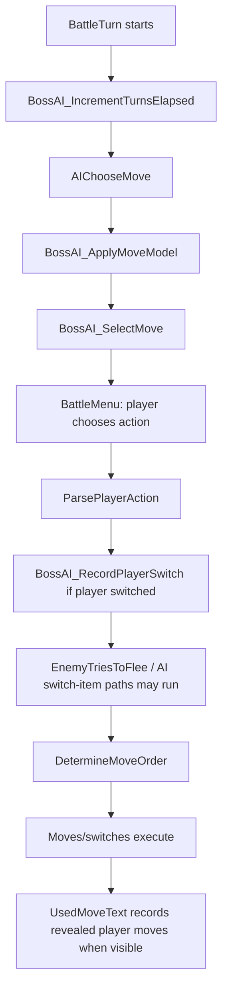

# Boss AI Spec

## Boss AI Cognition Mode

This spec is a launchpad, not a leash. Think like a brutal human opponent:
five-turn clocks, sacrifice lines, bait, counter-bait, setup windows, and "I
know that you know" loops. Journal the crazy version first; only implement the
part that stays fair, public-information-only outside explicitly authored Haki
branches, memory-budgeted, and testable.

Date: 2026-02-14
Scope: Trainer AI behavior design for major encounters (leaders, rival, E4, champion)

## Core Policy

Target behavior: **"absurdly strong but non-cheating"**.

AI wins by legal inference and good risk management, not hidden knowledge.

## Haki Exception Contract

Haki is the only intentional exception to the no-cheat rule. It is pure
cheating by design: one unfair, dramatic intervention per battle. The
discipline is not making Haki fair; the discipline is quarantining it so the
rest of Boss AI stays fair.

Current source has no broad Haki implementation. If one is added later, it
should be powerful but explicitly fenced:

- One activation per battle, cleared by `ClearBossAIState` and traceable when
  `BOSS_AI_TRACE` is enabled. A top-end flavor may define a short hidden
  duration such as three turns, but that duration is part of the single Haki
  activation and needs an explicit counter/state budget.
- Player-invisible. No Haki text, animation, icon, aura, field marker, special
  status, or other in-game tell. The player may see only an ordinary-looking
  boss action or normal battle outcome.
- Late-tier or deliberately authored major bosses only. Stronger bosses may get
  wider, meaner, more unique Haki powers, because Haki is their ace.
- May read current-turn player intent, selected move, hidden move details, hidden
  switch target, hidden party/item facts, or other private player state while
  spending the exception.
- May control the current turn's random outcomes, such as crit, miss, damage
  range, or secondary-effect rolls, if the flavor is explicitly an RNG Haki.
  Prefer choosing among outcomes that could normally occur so the field still
  looks ordinary.
- May permanently learn a compact hidden fact if the flavor is explicitly a
  permanent-info Haki. This must be byte-budgeted, traced, and stored as the
  smallest useful derived fact, not as copied player party data by default.
- May be overpowered and unfair. Do not weaken Haki toward normal fairness; keep
  it scarce, authored, invisible, traced for developers, and quarantined.
- Should be comically broken when it fires: an activation should guarantee a
  positive boss momentum swing unless there is no invisible, ordinary-looking
  way to cash the cheat.
- Should fire at a dramatic hinge, not for routine score optimization.
- Default forget rule: do not persist hidden knowledge after the Haki decision.
  Permanent-info Haki is the named exception and must document the exact compact
  fact, lifetime, and forget/reset rule.
- Must not become generic global omniscience, invisible always-on AI, illegal
  move/item execution, or a general bypass around normal battle rules. RNG
  control, post-input choice, multi-turn power, and permanent info are allowed
  only inside the authored Haki flavor that spent the activation.
- Must leave trace evidence that the Haki flag was spent and which broad reason
  caused the unfair intervention.

Implementation caution: `BossAI_SelectMove` runs before player input. A Haki
move-choice override would need a deliberate post-input override path with fresh
trace and legality checks. A narrower first source route, if approved, is still
`BossAI_SwitchOrTryItem` because that hook already runs after
`ParsePlayerAction`. Outside the spent Haki branch, current-turn player intent
and hidden player data remain forbidden.

## Haki Fire Gate Design

This is a design contract, not an implementation. Haki should not be a generic
score boost or panic button. It should fire only when a public battle hinge
becomes worth answering with one illegal lever.

Required shape:

- Public hinge first: visible board state must already show a major tempo,
  revenge, setup, ace-preservation, trap, or endgame crisis.
- One illegal lever: the Haki flavor may use exactly the private read,
  post-input choice, RNG control, temporary duration, or permanent-info scar it
  is authored to use.
- High decision delta: the private answer must change the action bucket, not
  merely improve chip or routine HP conservation.
- Guaranteed momentum: spending Haki should produce a clear positive swing for
  the boss. If the cheat would only make the score a little nicer, save it.
- Boss identity: the cheat should express that trainer's personality and team
  plan, such as Morty seeing death, Lance preserving Dragons, Karen punishing
  safe play, or Red silently denying the highest-swing line.
- Cheapness veto: do not spend Haki on routine optimization, turn-1 dominance
  unless explicitly authored, already-winning positions, already-hopeless delay,
  or lines the normal Boss AI would already choose confidently.
- Memory quarantine: default Haki facts die immediately. If a permanent-info or
  multi-turn Haki keeps state, the state must be named, compact, reset by battle
  cleanup, and forbidden to leak into ordinary public-inference memory.

Trace should prove the Haki activation was spent, which flavor fired, which
illegal lever was used, what public hinge justified it, what state or RNG scope
it touched, and what response bucket it changed.

### Haki Power Ladder And Invisibility

Haki is a hidden ace, not a visible form change. Its power should scale with the
boss:

- Authored mid-boss Haki: one hidden bool or category read, such as lethal
  current attack, committed switch, setup greed, or item dependence. It chooses
  one ordinary-looking response.
- Late gym / Elite Four Haki: one boss-flavored private packet, such as current
  action plus hidden active item/move category, committed switch target, or one
  scoped RNG outcome. It still spends once and normally discards the facts after
  the response.
- Lance / Blue-level Haki: one activation may be a full-turn board cheat, a
  brief domain packet, a compact private-info scar, or a current-turn RNG
  sovereignty packet. It may feel impossible, but it must still leave no
  player-visible Haki tell and no accidental normal-memory leak.
- Red-level Haki is the ceiling by a clear margin. `HAKI_RED_SILENT_CHECKMATE`
  is allowed to last exactly three hidden turns under one activation and may
  combine post-input choice, one compact scar, and one legal-looking Fate claim.
  Other bosses scale downward from this; none should equal Red's full package.

Haki power classes:

- `Oracle`: reads a hidden/current-turn fact and chooses after seeing it.
- `Fate`: controls one turn's possible RNG outcomes.
- `Scar`: permanently learns one compact hidden fact or role clue.
- `Dominion`: lasts for a short authored window, such as three turns, under one
  spent Haki activation.
- `Refusal`: denies the player the obvious reward, such as refusing a sack, safe
  revenge entry, or baited KO.

For `Fate` Haki, prefer selecting from outcomes the battle system could have
rolled naturally. A player can believe "bad luck"; they must not see a rule that
cannot happen without Haki.

Forbidden player-facing Haki tells:

- Battle text that names or hints at Haki.
- Unique animations, palettes, icons, weather, screens, stat auras, or special
  field states caused only by Haki.
- Impossible visible battle rules that prove the cheat happened.
- Later behavior that proves an unbudgeted or exact hidden fact leaked into
  normal AI memory.

Debug trace may expose Haki for developer proof. The ROM experience may not.

### Developer-Only Haki Flavor Records

Do not start by building a generic Haki engine. Before any source
implementation, each Haki flavor needs a developer-only record:

- Trainer gate: exact trainer class/id, tier, and optional active-mon gate.
- Power class: micro read, action packet, domain packet, or final-boss packet.
- Public hinge: the visible crisis that makes spending the ace dramatic.
- Private read: the hidden/current-turn facts this flavor may read while
  spending Haki.
- Illegal lever class: `Oracle`, `Fate`, `Scar`, `Dominion`, `Refusal`, or a
  named combination for final bosses.
- Duration and state: one-turn default, short counter, or permanent compact fact
  with exact WRAM/trace fields.
- Legal response bucket: ordinary-looking move, switch, item, or refusal lines
  the boss may choose.
- RNG scope, if any: crit, miss, damage roll, secondary effect, or other
  current-turn random outcome.
- Player-visible tell veto: what would reveal Haki and is therefore banned.
- Trace reason id: compact developer-only reason bucket.
- Forget rule: which private facts must die immediately after the response.

Current design records cost no WRAM. A source patch may add persistent state
only after checking `docs/generated/dev_index.md` and rerunning the memory
budget audit. The current Boss AI reserve is 140 bytes; current measured use is
75 / 65 bytes normal and 94 / 46 bytes with `BOSS_AI_TRACE`.

Initial flavor roster, grounded in current trainer parties except where an entry
explicitly marks a future move requirement. Early Johto leaders Falkner, Bugsy,
and Whitney intentionally do not have Haki; their Boss AI should stay legal and
public-information-only.

- Morty, `HAKI_MORTY_DEAD_MANS_HAND`: lethal-into-Ghost read; response bucket is
  legal Destiny Bond or the nastiest normal death-tax line. No text or palette
  cue.
- Chuck, `HAKI_CHUCK_FOCUS_PUNCH_READ`: solely a Focus Punch prediction Haki.
  It may read whether the committed player action will interrupt Focus Punch or
  gives Chuck a switch, item, heal, status, or setup window. The only Haki
  response bucket is legal Focus Punch; it must not improve Mach Punch,
  DynamicPunch, Hypnosis, Roar, Focus Band trades, or generic revenge play.
  Source note: Focus Punch now uses the former Kinesis slot, and Chuck carries
  it on Sudowoodo, Hitmontop, Hitmonlee, and Poliwrath only.
- Jasmine, `HAKI_JASMINE_LOCKED_DOOR`: current pressure packet for contact,
  super-effective hit, setup, or spin/removal line; response bucket is Protect,
  Explosion, Roar, Whirlwind, Thunder Wave, or a resist pivot.
- Pryce, `HAKI_PRYCE_COLD_COUNT`: escape-turn read for heal, setup, switch, or
  safe attack; response bucket is Encore, Roar, Explosion, Thunder Wave, Rest,
  or coverage that freezes the escape route shut.
- Clair, `HAKI_CLAIR_ROYAL_BLOOD`: anti-Dragon packet for Ice/Dragon/Rock
  pressure, hesitation, or resist pivot; response bucket is preserve Dragon,
  Agility, Thunder Wave, Outrage, or phazing.
- Rival, `HAKI_RIVAL_SPITE_LEDGER`: vendetta packet for the player's best answer
  to his starter/core; response bucket is Pursuit, Destiny Bond, Alakazam
  coverage, Crobat pressure, or starter setup/coverage.
- Will, `HAKI_WILL_FALSE_FUTURE`: action packet for attack, switch, item,
  setup, or status; response bucket is Reflect, Confuse Ray, Future Sight,
  coverage, Protect/Toxic/Explosion support, or Houndoom Pursuit/Sunny Day.
- Bruno, `HAKI_BRUNO_RING_GENERAL`: trade-shape packet for KO, wall pivot,
  resist pivot, or revenge threat; response bucket is Mach Punch, Rock Slide,
  Meditate, Cross Chop, Reversal posture, Pursuit, or an intentional sack.
- Koga, `HAKI_KOGA_POISON_PATENT`: hidden cleanse/item/status-plan packet;
  response bucket is Toxic only when it sticks, Spider Web trapping, Haze,
  Curse/Rest, Umbreon pursuit or confusion, Nidoking coverage, or Crobat Hyper
  Beam.
- Janine, `HAKI_JANINE_HEIRLOOM_VENOM`: inherited poison Haki tuned for her
  faster late-game roster; response bucket is Toxic only when it sticks, Spikes,
  Haze, Curse/Rest, Sleep Powder, Explosion, or Nidoking/Weezing/Venomoth
  coverage.
- Karen, `HAKI_KAREN_BAD_FAITH`: safest-line read for switch, heal, setup,
  status, or kill; response bucket is Pursuit, Destiny Bond, Roar, Sunny Day,
  Toxic/confusion, or Houndoom/Tyranitar punishment.
- Lance, `HAKI_LANCE_DRAGON_KINGS_PRIVILEGE`: anti-Dragon kill/neuter packet
  plus wincon-preservation read; response bucket is preserve Dragonite/Gyarados,
  accept a trade, Dragon Dance, Outrage, Rain Dance, Hyper Beam, or phazing.
- Brock, `HAKI_BROCK_FOSSIL_LOCK`: Water/Grass/Fighting setup or removal packet;
  response bucket is Protect, Recover, Curse, Explosion, Swords Dance, Roar, or
  Aerodactyl pressure.
- Misty, `HAKI_MISTY_TIDE_CLAIM`: Electric/Grass revenge, water-resist pivot,
  or heal/setup read; response bucket is Rain Dance, Hypnosis, Thunder Wave,
  Rest, Rapid Spin, or coverage.
- Lt. Surge, `HAKI_SURGE_CIRCUIT_BREAKER`: Ground answer, heal, or setup packet;
  response bucket is Air Balloon Magneton pressure, Light Screen, Thunder Wave,
  Quick Attack, coverage, or Explosion.
- Erika, `HAKI_ERIKA_GARDEN_TRAP`: Fire/Flying/Ice pressure, status immunity,
  or setup greed read; response bucket is Sleep Powder, Leech Seed, Encore,
  Sunny Day, Synthesis, Swords Dance, or Explosion.
- Sabrina, `HAKI_SABRINA_FUTURE_COURT`: physical/special/status/switch packet;
  response bucket is screens, Encore, Lovely Kiss, Perish Song, Baton Pass,
  Morning Sun, or Choice Specs coverage.
- Blaine, `HAKI_BLAINE_FLASHPOINT`: Water/Rock/Ground revenge or setup packet;
  response bucket is Sunny Day, Safeguard, Confuse Ray, Quick Attack /
  Extremespeed, Roar, or surprise coverage.
- Blue, `HAKI_BLUE_CHAMPIONS_ANSWER`: six-role counter packet for committed
  action plus switch target category; response bucket is the one team member
  that turns the line, including Choice Band pressure, Porygon2 coverage,
  Gyarados setup, Rhydon Roar, or Arcanine priority/Roar.
- Red, `HAKI_RED_SILENT_CHECKMATE`: final-boss ceiling and strongest Haki by a
  clear margin. One activation opens exactly three hidden turns. Across that
  window Red may choose after seeing committed action categories, keep one
  compact hidden role scar, and claim one legal-looking RNG outcome. The response
  bucket is ordinary-looking move, switch, item denial, safe-entry denial,
  preserve-ace line, or forced momentum conversion of the player's highest-swing
  line. No speech, no marker, no mercy.

This roster is not permission to implement all flavors at once. Source should
land one flavor at a time with trace proof, memory proof, and no player-visible
tell.

### First Source Prototype Recommendation

Use Lance's `HAKI_LANCE_DRAGON_KINGS_PRIVILEGE` as the first source plumbing
prototype unless the cycle is specifically proving post-input move overrides.
Morty's `HAKI_MORTY_DEAD_MANS_HAND` is the stronger myth, but it asks the first
implementation to solve move override legality, trace/chosen-move consistency,
Destiny Bond timing, PP/disable gates, and lethal-read boundaries all at once.

Lance's Haki fits the existing post-input switch/refusal surface better:

- Call only from `BossAI_SwitchOrTryItem` after player action is committed.
- Gate to `CHAMPION, LANCE`, late tier, Haki unused, and a visible Dragon plan
  hinge such as active Dragonite/Gyarados at meaningful risk.
- Private read may ask whether the committed action is an anti-Dragon kill or
  neuter line, and whether preserving the Dragon wincon beats taking the trade.
- Response bucket is ordinary battle behavior: keep the current mon in, switch
  to an already-alive legal teammate, accept a sack/trade, or raise/lower switch
  confidence. No special text, animation, aura, or field state.
- The private move/category and any reserve clue must not be written into normal
  Boss AI memory. Trace may record only a compact Haki reason id and response
  bucket.

Do not implement this as a compiled all-boss Haki table. The first source patch
should be one hand-authored flavor with one Haki-used flag, trace proof, memory
budget proof, and no Battle Core hook.

### Mercy Refusal Candidate

`Mercy Refusal` is a high-value Haki fantasy, but not the first source patch.
The boss reads that the player is offering bait, a doomed active mon, a sack
line, or a nonthreatening correction, then refuses the obvious KO/switch and
chooses setup, status, phazing, trap pressure, weather, hazards, or another
ordinary-looking punish.

Useful split:

- Fair public version: if the active player mon is visibly doomed and has no
  public threat, normal Boss AI may value setup/status/phazing over a low-value
  KO without using Haki.
- Haki version: after player action is committed, the boss may spend Haki to
  confirm the current line is bait, sack, heal/item, weak chip, setup, or switch
  target bait, then choose the non-KO punish bucket.

Current fair implementation:

- `engine/battle/ai/boss.asm`, `.ApplyMercyRefusalBias`.
- Late tier only.
- Candidate must be non-damaging setup, live Spikes, or publicly valid status.
- Player active must be visibly at quarter HP or lower.
- Boss must not be under public pressure.
- Boss must already have a KO-pressure move available.
- The result is only a small score encouragement. It does not force the line,
  read the player's input, or inspect hidden reserve data.

Implementation caution: most Mercy Refusal variants are post-input move
overrides. They need the same legality and trace discipline as Morty's move
Haki: no `BossAI_SelectMove` peeking, no hidden fact persistence, no false trace
chosen move, and no "the boss now knows this player move/item forever" leak.

Prototype caution: Morty's "Dead Man's Hand" is a strong first Haki spec
candidate but a delicate source patch. It is a move-choice Haki, so do not
implement it by letting `BossAI_SelectMove` peek at player input or by hiding it
as a normal score tweak. If approved, it needs a deliberately named post-input
override path after `ParsePlayerAction` and before enemy move execution. That
path may spend Haki, write a legal move such as `DESTINY_BOND` into
`wCurEnemyMove` / `wCurEnemyMoveNum`, update trace honestly, then return without
switching or using an item so normal `DoEnemyTurn` execution and battle-rule
checks still apply.

### Post-Input Haki Move Override Contract

A move-choice Haki such as Morty's "Dead Man's Hand" must be implemented as an
explicit post-input override, not as normal move scoring.

Allowed shape:

- Call only from the post-input window, currently at the top of
  `BossAI_SwitchOrTryItem` after `BossAI_SelectPlanIfNeeded` /
  `BossAI_ComputePlayerPlausibleTypeMask` and before normal KO-pressure early
  returns.
- Inherit the caller's safety gates. The override must not run in link/wild
  battles or while enemy lock, trapping, or wrap checks have already rejected
  action changes.
- Return zero with carry clear for no Haki; return nonzero with carry clear
  after writing a legal Haki move. Never return carry for a move override,
  because carry means switch/item to battle flow.
- Gate on player action already being locked, such as
  `wBattlePlayerAction == BATTLEPLAYERACTION_USEMOVE`, and keep current-turn
  reads inside the spent Haki branch only.
- For Destiny Bond-style Haki, require legal timing such as
  `wEnemyGoesFirst != 0`; Haki may not make Destiny Bond retroactive.
- On override, write `wCurEnemyMove` / `wCurEnemyMoveNum`, spend Haki before
  returning, update trace chosen-move/Haki reason fields, and keep
  chosen-move/repeat memory consistent with the actual move.
- Do not store the selected player move, exact damage, hidden item, hidden
  party facts, or other private facts anywhere outside explicit trace/Haki
  reason fields.

## First-Playthrough Boss Promise

Bosses exist to restore the childhood feeling that a gym leader might actually
beat you. They should feel prepared, observant, and dangerous, but never
clairvoyant. The player should lose because a leader played the public board
well, punished autopilot, or made a risky line credible, not because the ROM
read hidden party data or current-turn input.

The goal is scary Johto, not competitive perfection. Prefer readable pressure,
probabilistic prediction, and role identity over deterministic scripts or
omniscient counterplay.

## AI Tiers

### Early Tier (Badges 1-3)

- Uses obvious high-value lines and simple KO checks.
- Limited prediction depth.
- Conservative switching to avoid player confusion spikes.

### Mid Tier (Badges 4-6)

- Adds deny-KO and tempo-aware lines.
- Starts probabilistic prediction from observed player behavior.
- Uses role-aware switching with confidence gates.

### Late Tier (Badges 7-8, E4, Champion)

- Full weighted scoring model enabled.
- Stronger setup punishment and pivot discipline.
- Higher tolerance for advanced lines, but still bounded by no-cheating invariants.

## Move Scoring Model

Per legal move, compute total score:

`Total = KO + DenyKO + Tempo + SetupWindow + StatusValue + RoleBias - Risk`

Scoring components:

- `KO`: large bonus when projected KO chance is high.
- `DenyKO`: bonus for lines that prevent likely player KO next turn (protective/status/utility lines).
- `Tempo`: bonus for maintaining initiative, forcing unfavorable trades, or creating safe pivots.
- `SetupWindow`: bonus for setup only when board is safe enough (no high immediate punish probability).
- `StatusValue`: weighted by target role and encounter phase (sleep/paralysis/burn/poison value differs by context).
- `RoleBias`: mon-specific intended behavior (lead/pivot/wall/breaker/cleaner/ace).
- `Risk`: penalty for low-accuracy or high-self-punish lines unless upside is decisive.

Current public trade traps:

- `engine/battle/ai/boss.asm`, `.ApplyDestinyBondTradeBias`.
- Mid/late bosses may value Destiny Bond when the boss is visibly at quarter HP
  or lower, has no KO line, the active player has a public threat, and the boss
  is publicly faster.
- This is a pressure read, not input reading. It must not inspect the player's
  selected move, hidden moves/items, hidden reserves, damage rolls, or RNG.
- `engine/battle/ai/boss.asm`, `.ApplyRevealedDestinyBondAvoidance`.
- Mid/late bosses may penalize KO-pressure moves into the active player after
  that active player has exactly revealed Destiny Bond, is visibly at quarter HP
  or lower, and public base-speed logic says the boss does not move first. This
  is delayed public move memory, not current-turn intent reading.
- `engine/battle/ai/boss.asm`, `.ApplyCounterCoatTradeBias`.
- Mid/late bosses may value Counter or Mirror Coat when the active player has
  already revealed a damaging move of the matching public type category, the
  boss has no KO line, the active player has public threat, the boss is not
  publicly faster, and the reflected move can hit the player's visible typing.
- The Counter/Mirror Coat model uses revealed move type category only. It must
  not call effective-category helpers that inspect hidden player stats, and it
  must not inspect the player's selected move this turn.
- `engine/battle/ai/boss.asm`, `BossAI_CurrentEnemyMoveScoredPower`.
- Flail/Reversal store `MOVE_POWER = 1` until their battle effect rewrites
  power from the user's HP. Boss scoring treats the boss's own public HP bands
  as pressure thresholds instead: at quarter HP or lower they score as high
  pressure, and at half HP or lower they score as mid pressure.
- This is legal because it uses only the boss's own HP band, own current move
  effect, and the existing public matchup pipeline. It must not inspect the
  player's current-turn choice, hidden moves/items, hidden reserves, RNG futures,
  or exact future damage rolls.

## Decision Breadth And Play Budget

The AI should notice more options than it deeply calculates.

Use three layers:

- Raw legal buttons: score every legal move and every relevant legal switch the
  current architecture can see.
- Strategic candidates: project only the few plays that can decide the turn.
- Reply buckets: model coarse player responses, not exact hidden intent.

Current source caps:

- `NUM_MOVES = 4`.
- `BOSS_AI_LOOKAHEAD_N = 4`.
- `BOSS_AI_LOOKAHEAD_M = 3`.
- `BOSS_AI_LOOKAHEAD_HORIZON_MID = 4`.
- `BOSS_AI_LOOKAHEAD_HORIZON_LATE = 5`.
- `BOSS_AI_SWITCH_CANDIDATE_CAP = 4`.

Target behavior:

- Early bosses: deeply consider 2 plays, with 1-2 coarse reply buckets.
- Mid bosses: deeply consider 3 plays, with 2 coarse reply buckets and a
  4-turn horizon.
- Late bosses, Elite Four, Lance, Red, and other major endgame bosses: deeply
  consider 4 plays, with 3 coarse reply buckets and a 5-turn horizon.

The late-boss four-play shape is:

1. Best forcing line.
2. Safest non-losing line.
3. Greed, setup, status, or resource line.
4. Counter-read line: the "I know you know" play.

Do not expand this into broad literal game-tree search. For example, 8 immediate
actions times 4 player replies over 5 turns is already more than 33 million
terminal branches. That is not human-like; it is fantasy search. Strong boss AI
should cheaply score the visible board, keep a small beam of credible plays,
project through coarse reply buckets, then let plan identity and risk decide
close calls.

If `BOSS_AI_LOOKAHEAD_M` is used in a future implementation, prefer using it for
the 3 player reply buckets: stay/attack, preserve/switch, and greed/setup. Do
not use it to add more AI candidate plays unless a concrete trace proves that
the fourth candidate beam is hiding a real boss-quality line.

## Switching Logic

### Confidence thresholds

- Evaluate stay-vs-switch confidence each turn.
- Suggested thresholds:
  - Early tier: switch only if confidence to improve board >= `0.80`.
  - Mid tier: >= `0.70`.
  - Late tier: >= `0.60`.

### Anti-loop cooldown

- Any mon that switches out gets a short switch cooldown.
- During cooldown, switching that same mon again requires +0.10 extra confidence.
- Forced exceptions: imminent KO prevention, public Perish Song escape,
  immunity pivot opportunity, or scripted ace timing.

Goal: prevent repetitive pivot loops while preserving smart tactical switching.

### Current public revenge denial

Current implementation: `engine/battle/ai/boss.asm`,
`BossAI_ShouldRespectPotentialPlayerRevenge`.

When a boss has a KO-pressure move, `BossAI_SwitchOrTryItem` normally stays in
and takes the prize. The exception is when public state says the KO may open a
revenge door:

- The active player has a public/revealed threat into the boss.
- The boss is in a public HP band where that threat matters.
- A suspicious fresh switch-in suggests the player entered a coverage/pivot
  line.
- For mid and late bosses, already-seen bench species can also count as a
  revenge warning if they are still publicly alive and their public STAB types
  threaten the current boss. Two or more such seen bench species are enough by
  themselves; one seen bench species matters when the boss is at half HP or
  lower.

This is not hidden party reading. The seen-species branch uses only species that
have already appeared in battle, public faint/send-out events, public base
types, the boss's current public HP band, and the existing type-matchup helper.
It must not infer unseen reserve species, hidden reserve HP, hidden player
items, hidden exact moves, or current-turn player intent.

### Current public Perish Song escape

Current implementation: `engine/battle/ai/boss.asm`,
`BossAI_EnemyPerishEscapeUrgent`.

When the boss's own active mon is publicly under Perish Song and
`wEnemyPerishCount` is `1` or `2`, `BossAI_SwitchOrTryItem` may bypass the usual
"take the KO and stay" gate and try to switch. `BossAI_ComputeSwitchConfidence`
also adds a strong `+40` confidence bonus, capped at `99`, before ordinary
player-switch prediction. The A->B->A loop penalty treats this as a public
emergency exception.

This is legal because it reads only the boss's own visible perish substatus and
count. It must not infer whether the player will re-trap, click Perish Song
again, or reveal a hidden trapping move. The whole point is simpler and meaner:
a boss that can hear its own death clock should not sit there taking a shiny KO
while the clock wins the battle.

## Prediction Logic

Prediction is probabilistic, never deterministic.

Allowed prediction inputs only:

- Seen player Pokemon species.
- Revealed player moves.
- Observed player switching patterns over the current encounter history.

Forbidden prediction inputs:

- Unseen party members.
- Unrevealed moves/items/stats.
- Future player button input.

Prediction method:

- Build weighted action priors from observed history.
- Sample from top predicted player lines (not single hard counterpick).
- Select AI action by expected value across predicted distribution.

### Current switch prediction formula

Current implementation: `engine/battle/ai/boss.asm`, `BossAI_PredictPlayerSwitch`.

The routine starts from a baseline of `10`, then applies only observed/public
state:

- If committed `wBossAIPlayerSwitchCount * 2 >= wBossAITurnsElapsed`, add `20`.
- Else if the player has switched at least once, add `10`.
- If the player's active Pokemon is not at quarter HP or lower, add `20`.
- If public/observed threat checks say the player plausibly pressures the enemy,
  add `15`.
- If the player has revealed a super-effective damaging move, subtract `10`.
- Cap final predicted switch chance at `80`.

This prediction is intentionally heuristic. Future changes should preserve the
rule that it is based on previous observations and public state, not current
hidden input.

`BossAI_RecordPlayerSwitch` must write current-turn switch observations to
pending state only. `BossAI_IncrementTurnsElapsed` commits that pending state on
the next turn before `BossAI_PredictPlayerSwitch` can consume it.

## Turn-Order Safety

Boss AI timing has a specific cheating hazard: move choice and switch/item
choice do not happen at the same point in the turn.



Safety rules:

- `BossAI_SelectMove` is before player input, so move scoring cannot peek at the
  current player action unless another routine already stored unsafe state.
- `BossAI_RecordPlayerSwitch` runs during `ParsePlayerAction`, before some
  enemy switch/item logic can run later in the same turn.
- Any new state derived from `BossAI_RecordPlayerSwitch` must be pending-only
  until the next `BossAI_IncrementTurnsElapsed`.
- Revealed move tracking is safe only after the move is visibly used. Do not
  infer unrevealed moves from party data or exact private stats.

Key source anchors:

- `engine/battle/core.asm`: `BossAI_IncrementTurnsElapsed`, `AIChooseMove`,
  `BattleMenu`, `ParsePlayerAction`, `BossAI_RecordPlayerSwitch`,
  `DetermineMoveOrder`.
- `engine/battle/ai/move.asm`: `BossAI_ApplyMoveModel`,
  `BossAI_SelectMove`.
- `engine/battle/ai/items.asm`: `AI_SwitchOrTryItem`,
  `BossAI_SwitchOrTryItem`, `BossAI_OnSwitchExecuted`.
- `engine/battle/used_move_text.asm`: `BossAI_RecordRevealedPlayerMove`.
- `engine/battle/read_trainer_attributes.asm`: `LoadBossAITier`,
  `ClearBossAIState`.
- `engine/battle/ai/switch.asm`: legacy enemy switch scoring helpers. Boss
  model code should prefer boss-safe wrappers in `engine/battle/ai/boss.asm`.

## Player Knowledge Model Quick Trace

Use this route for questions about how boss AI knows, remembers, or infers
player Pokemon and player moves. The important distinction is that boss AI
tracks exact seen species, but it tracks player move knowledge mostly as threat
types, not as hidden exact moves.

Send-out path:

- `engine/battle/core.asm`: `BattleMonEntrance` calls `NewBattleMonStatus`.
- `NewBattleMonStatus` clears the active-mon `wPlayerUsedMoves` list, then calls
  `BossAI_RecordPlayerSpecies`.
- `engine/battle/ai/boss.asm`: `BossAI_RecordPlayerSpecies` appends only the
  active `wBattleMonSpecies` to `wBossAISeenPlayerSpecies` and marks that seen
  species slot alive in `wBossAISeenPlayerAliveMask`.
- `engine/battle/core.asm`: `UpdateFaintedPlayerMon` calls
  `BossAI_RecordPlayerFaint`.
- `BossAI_RecordPlayerFaint` clears only the matching seen-species alive bit
  after the active player Pokemon visibly faints.

Visible move reveal path:

- `engine/battle/used_move_text.asm`: `UsedMoveText` updates `wPlayerUsedMoves`
  only when a player move is visibly used, then calls
  `BossAI_RecordRevealedPlayerMove`.
- `BossAI_RecordRevealedPlayerMove` finds the active species slot with
  `BossAI_GetActiveSpeciesRevealedMaskPointer`.
- `BossAI_AddRevealedMoveToSpeciesMask` stores the revealed damaging move type
  in that species' 4-byte mask. Hidden Power sets
  `BOSS_AI_PLAUSIBLE_HP_RISK_BIT`; status moves are not stored as threat types.
- Runtime storage is `wBossAIRevealedMovesBitmap`: six 4-byte per-seen-species
  revealed type masks. The old spare bytes around that reserve include
  `wBossAILikelyTypeMaskCache`, a 4-byte active-species confidence mask,
  `wBossAISeenPlayerAliveMask`, a 1-byte public alive mask for seen species
  slots, and 3 bytes of spare reserve.

Plausible move inference path:

- `BossAI_ApplyMoveModel` and `BossAI_SwitchOrTryItem` both call
  `BossAI_ComputePlayerPlausibleTypeMask` before using plausible player threat
  knowledge.
- `BossAI_ComputePlayerPlausibleTypeMask` builds `wBossAIPlausibleTypeMaskCache`
  from public active species facts: current STAB types, per-species revealed
  damaging move types, active-species and pre-evolution-chain legal TM/HM
  learnability, active-species and pre-evolution-chain level-up moves at or
  below `wBattleMonLevel`, and active-species and pre-evolution-chain egg moves.
- The companion `wBossAILikelyTypeMaskCache` marks higher-confidence threats:
  STAB, revealed damaging move types, and current-species level-up moves at or
  below `wBattleMonLevel`. TM/HM coverage, egg moves, and pre-evolution-only
  moves remain possible but are weighted as speculative coverage.
- `BossAI_AddMoveIdToPlausibleMask` ignores non-damaging moves, ignores
  damaging moves below `BOSS_AI_PLAUSIBLE_MIN_POWER`, stores regular damaging
  moves by type, and stores Hidden Power as the special HP risk bit.
- `BossAI_GetPrimaryThreatType`, `BossAI_ShouldScout`,
  `BossAI_RefineSwitchCandidateForPlausibleRisk`, and
  `BossAI_ApplyPlausibleRiskToSwitchConfidence` are the main consumers.
- Switch risk scans likely threats at the normal tier weight and scans
  possible-only threats at half that weight. Possible-only threats can still
  drive scouting or matter on 4x matchups, but they should not dominate the same
  way as revealed, STAB, or current-level-up threats.

Review rule: a fresh switch-in may justify species/level/type/legal-learnset
plausible threat inference, but it must not justify reading the player's actual
unrevealed four move slots, hidden party slots, held items, or private stats.

### Plausible Threat Edit Map

Use this map before changing player-move inference or switch-risk behavior. It
captures the boundaries that are easy to forget mid-edit.

Core mental model:

- `wBossAIPlausibleTypeMaskCache` means "this damaging type is legal enough to
  respect."
- `wBossAILikelyTypeMaskCache` means "this damaging type is a higher-confidence
  threat."
- Likely must be a subset of possible. Revealed damaging move types and STAB go
  into both masks. Current-species level-up moves at or below `wBattleMonLevel`
  go into both masks. TM/HM coverage, egg moves, and pre-evolution-only moves go
  into possible only.
- Hidden Power uses `BOSS_AI_PLAUSIBLE_HP_RISK_BIT`; treat possible-only Hidden
  Power as scout pressure, not the same panic level as revealed or likely HP.

State and cache rules:

- `BossAI_RecordRevealedPlayerMove` invalidates
  `wBossAIPlausibleTypeMaskSpecies` and `wBossAIPlausibleTypeMaskLevel`, so the
  next consumer recomputes both possible and likely masks.
- `BossAI_ClearPlausibleMask` must clear both masks together.
- `BossAI_AddSpeciesAndPreEvolutionMovesToMask` temporarily mutates
  `wCurPartySpecies`, `wCurSpecies`, and base data while walking pre-evolutions;
  it must restore the active species and call `GetBaseData` before returning.
- Avoid using `wBossAITemp3` across helper calls inside switch-candidate
  refinement; that byte also holds the current best switch candidate. Prefer
  stack preservation for tiny one-byte saves in nested plausible-risk helpers.

Review traps:

- Do not read `wBattleMonMoves`, `wBattleMonPP`, `wBattleMonItem`, player party
  structs, or current input to make boss decisions. The legal source for
  unrevealed move inference is public species/level plus move tables.
- Do not return early from level-up learnset scans just because one move is above
  the active level; learnsets may not be sorted the way the shortcut assumes.
- If new code is inserted into `BossAI_ComputeSwitchCandidateRisk`, recheck local
  `jr` ranges. This function is large enough that short branches can silently
  become link-time failures.
- If a helper changes `hBattleTurn` for type-matchup simulation, restore it on
  every exit path.

Fast verification for this area:

```powershell
python tools\audit\check_boss_ai_no_cheat.py
python tools\audit\check_boss_ai_gating.py
python tools\audit\check_boss_ai_trace_invariants.py
python tools\audit\check_boss_ai_memory_budget.py
python tools\audit\check_docs_navigation.py
```

## Legacy AI Scoring Interaction

Current implementation: boss trainers skip the normal AI scoring layers in
`engine/battle/ai/move.asm` and jump directly to the boss model when
`wBossAITier != 0`.

Rules:

- Keep boss move selection on the boss model unless legacy scoring has been
  audited for hidden-information reads.
- If a legacy helper needs private player information for ordinary trainers,
  gate that helper off for boss tiers or replace it with public/observed state.
- `AI_Smart_MeanLook` defensively skips `AICheckLastPlayerMon` for boss tiers
  because that helper scans hidden player party HP.
- If normal scoring is ever re-enabled for boss tiers, re-audit
  `engine/battle/ai/scoring.asm` before relying on it.

## Boss-Safe Decision Helpers

The boss model should use wrappers that avoid exact private player stats and
hidden party information:

- `BossAI_CurrentEnemyMoveHasKOPressure`: heuristic KO pressure from move power,
  public typing, STAB, type matchup, and coarse public HP bands.
- `BossAI_CurrentEnemyMovePressureScore`: shared pressure score used by move
  scoring and lookahead.
- `BossAI_PlayerHasPublicThreatVsEnemy`: revealed player moves first, then
  current public typing as a fallback.
- `BossAI_PlayerHasRevealedPriorityThreat`: exact active-stint revealed priority
  moves only. It lets the boss treat Quick Attack / Mach Punch / ExtremeSpeed
  as speed-breaking pressure when coarse HP and public matchup make them
  credible, without inferring unrevealed priority from move slots or party data.
- `BossAI_ComputeSwitchCandidateRisk`: also gives a small risk penalty to
  half-HP-or-lower switch candidates that would enter into a neutral-or-better
  exact revealed priority move from the active player. This uses only
  `wPlayerUsedMoves`, candidate base typing, and the boss's own candidate HP.
- `.ApplyRevealedProtectCommitmentRisk`: discourages catastrophic commitment
  moves such as Selfdestruct and Hyper Beam after the active player has exactly
  revealed Protect or Detect. This is a small public-memory penalty, not a
  current-turn Protect read.
- `.ApplyRevealedRecoveryDenialBias`: after the active player has exactly
  revealed Recover/Rest/Softboiled/Milk Drink/Morning Sun/Synthesis/Moonlight
  style recovery and is not at full HP, mid/late bosses slightly favor legal
  anti-loop tools such as Toxic, Leech Seed, and force-switch moves when they do
  not already have a KO line.
- `.ApplyRevealedFastEncoreAvoidance`: after the active player has exactly
  revealed Encore, mid/late bosses discourage recovery, Protect, Substitute, and
  setup-style commitment moves when `BossAI_PublicEnemyFaster` says the boss does
  not move first. This is delayed public memory plus public speed estimation, not
  a read of the player's current-turn choice.
- `.ApplyRevealedDestinyBondAvoidance`: after the active player has exactly
  revealed Destiny Bond and is visibly at quarter HP or lower, mid/late bosses
  discourage KO-pressure moves if `BossAI_PublicEnemyFaster` says the boss does
  not move first. This is a public one-for-one trade risk, not a read of the
  player's current-turn choice.
- `.ApplyLastMoveEncoreTrapBias`: if the active player's last visible move was
  Protect/Detect or a recovery effect, mid/late bosses may give Encore a larger
  trap reward only when Encore is not already active, public fail gates pass, and
  `BossAI_PublicEnemyFaster` says the boss should move first. This uses
  `wLastPlayerMove`, not the player's current-turn choice or hidden move/PP
  state.
- `.ApplyRevealedCounterCoatAvoidance`: after the active player has exactly
  revealed Counter or Mirror Coat, mid/late bosses discourage matching non-KO
  damaging moves that can hit the visible active target. This uses revealed move
  effects, the boss candidate's effective category, public matchup, and visible
  KO pressure; it does not predict the player's current turn.
- `.ApplyRevealedAntiSetupAvoidance`: after the active player has exactly
  revealed Haze or a force-switch move such as Roar/Whirlwind, mid/late bosses
  discourage non-KO boost-style setup. This is intentionally narrower than
  `.IsSetupMove`: Rain Dance and Sunny Day are not treated as boost setup because
  Haze does not erase weather.
- `.ApplyRevealedSelfdestructProtectBias`: after the active player has exactly
  revealed Selfdestruct or Explosion and is visibly at half HP or lower, mid/late
  bosses may favor Protect/Detect if it is publicly usable and the boss has no
  other public KO move. This is a public sacrifice-threat scout, not a read of
  the player's selected move.
- `.PlayerHasRevealedEffectA`: shared single-effect scanner for exact active
  `wPlayerUsedMoves` effects. Use it for future public revealed-effect checks
  before adding another bespoke scan loop; it reuses `wBossAITemp`, preserves the
  score pointer, and must remain forbidden from hidden move slots, hidden PP, and
  current-turn input.
- `.UtilityMoveWouldFailPublicly`: public fail gate for obvious utility failures.
  Disable may check already-active player Disable and public
  `wLastPlayerCounterMove` empty/Struggle states, but must not inspect hidden
  player move slots or PP. Encore may check already-active player Encore and
  public `wLastPlayerMove` empty/Struggle/Encore/Mirror Move states, but must
  not inspect hidden player move slots or PP. Mean Look / Spider Web may check
  public already-trapped state via `SUBSTATUS_CANT_RUN`, but must not inspect
  hidden reserve availability or last-mon legality; damaging partial-trap moves
  such as Wrap/Fire Spin/Whirlpool are not full utility fails because their
  damage can still matter after the trap side effect is blocked or redundant.
  Dream Eater must check both visible player Substitute and visible sleep status.
  Nightmare must check visible player Substitute, visible sleep status, and
  already-active Nightmare. Both mirror battle-engine fail paths without reading
  current-turn intent.
- `BossAI_ShouldRespectPotentialPlayerRevenge`: stay-vs-switch guard that can
  refuse an easy KO when public active pressure or already-seen player species
  suggest a revenge door.
- `BossAI_EnemyPerishEscapeUrgent`: public own-side Perish Song escape guard
  for `wEnemyPerishCount` `1` or `2`; it can override KO-stay and switch-loop
  reluctance without reading hidden player state.
- `BossAI_NeedsLoopPenalty`: A->B->A switch-loop guard. The loop penalty is
  waived for low current HP, public revenge pressure, own Perish Song escape,
  public immunity pivots, or ace timing; generic public type pressure alone is
  not enough to waive the cost.
- `BossAI_SeenBenchThreatScore`: public seen-species STAB pressure estimate
  excluding the current active bait and publicly fainted seen species; legal
  only for species already revealed in the current battle.
- `BossAI_PublicEnemyFaster`: public species base-speed estimate, not exact
  runtime speed stats.
- `BossAI_CheckPlayerMoveTypeMatchupVsEnemyNoItem` and
  `BossAI_CheckEnemyMoveTypeMatchupVsPlayerNoItem`: type matchup without held
  item peeking.
- `BossAI_CheckAbleToSwitchSafe`: boss switch candidate check that avoids
  player hidden-information scoring.

Treat direct boss-model calls to `AIDamageCalc`, `AICompareSpeed`, or
`CheckPlayerMoveTypeMatchups` as suspect unless the caller is clearly ordinary
AI or battle resolution rather than boss decision knowledge.

## Runtime State Budget

Boss AI runtime state lives in `ram/wram.asm`, in WRAMX bank 1, because battle
code reads and writes it directly without WRAM bank switching.

Reserved block:

- Start: `wBossAITier`.
- Normal-build logical end: `wBossAIStateEnd`.
- Reserved size: `140` bytes, enforced by
  `ds 140 - (wBossAIStateEnd - wBossAITier)`.
- Current normal build: `wBossAITier = 01:d72b`,
  `wBossAIStateEnd = 01:d776`, so normal state uses `75` bytes and leaves `65`
  reserved bytes.
- Current trace field set adds `19` bytes under `BOSS_AI_TRACE`, so trace state
  would use `94` bytes and leave `46` reserved bytes.

Adding 2-3 bytes to this block is acceptable in principle, but every change must
still be build-verified because WRAMX overall has no free unreserved space.
Never move save-compatible or unrelated WRAM fields casually to make room.
For exact current addresses and byte counts, treat `docs/generated/dev_index.md`
as the source of truth; refresh it after linker outputs change.

## Implementation Checklist For Boss AI Changes

- Confirm the new signal is legal public or previously observed information.
- Decide whether the signal is same-turn unsafe. If yes, commit it only at the
  next `BossAI_IncrementTurnsElapsed`.
- Update or inspect `ClearBossAIState` coverage if adding fields.
- Check `AIChooseMove`, `AI_SwitchOrTryItem`, and execution flow for both player
  and enemy timing.
- Verify bank `0e` size and avoid moving logic into tight `Battle Core` bank
  `0f` unless necessary.
- Refresh `docs/generated/dev_index.md` after a build changes symbols.

## Known Remaining Fairness Risk

Exact battle helpers such as `AIDamageCalc` and `AICompareSpeed` remain in the
legacy AI code and battle engine. Those helpers use exact active Pokemon stats,
including private player stat values. That is stronger than a human-like
estimate when used for boss decision knowledge.

Future fix direction:

- Add boss-safe damage and speed estimators based on public species, level,
  typing, stat stages, revealed moves, and observed damage ranges.
- Keep exact helpers for ordinary AI or internal battle resolution, but do not
  use them for boss decision knowledge unless the exact value has become public
  through observed turn order or damage.
- Treat any new direct boss-model call to those exact helpers as a review
  finding unless it is deliberately documented and justified.

## Explicit No-Cheating Invariants

- AI cannot read hidden player party slots.
- AI cannot read unrevealed moves, held items, or private stat data.
- AI cannot peek player input before action lock.
- AI cannot alter RNG outcomes after decision.
- AI cannot bypass normal PP, priority, accuracy, or legality checks.
- AI cannot execute illegal move/item combinations.
- AI and player run on the same battle ruleset and damage model.

## Logging and Tuning Hooks (Design)

- Emit per-turn debug trace in development builds:
  - top 3 move scores
  - switch confidence
  - prediction distribution
  - chosen action + reason code
- Use traces to tune weights per tier without changing no-cheating invariants.
